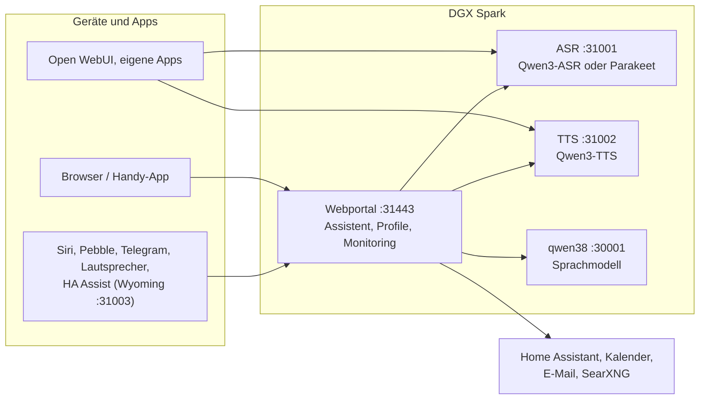

# Speech auf DGX Spark

[English](README.md) | **Deutsch** · Idee: Dominik Bornhäußer

Spracherkennung (**Qwen3-ASR**) und Sprachausgabe (**Qwen3-TTS**) als Dienste auf einer NVIDIA DGX Spark (GB10), dazu ein Webportal mit Sprach-Assistent, Profilen und Monitoring. Läuft nativ mit systemd, ohne Docker, neben [dgx-spark-qwen38](https://github.com/hasso5703/dgx-spark-qwen38), das das Sprachmodell liefert.

## Installation

```bash
git clone https://github.com/db9979/speech-on-dgx-spark
cd speech-on-dgx-spark
sudo ./install.sh
```

Das Skript fragt, was installiert werden soll:

- **Komplett**: Modelle, APIs und das Webportal mit dem Assistenten.
- **Nur die Modelle mit ihren APIs**: für Open WebUI, eigene Apps oder Home Assistant, ohne Portal. Verwaltet wird dann mit `sudo speech-spark`.

Am Ende stehen Adresse, Passwort und API-Schlüssel auf dem Bildschirm, danach spricht die Sprachausgabe einen Satz und die Spracherkennung prüft ihn. Das Portal liegt auf `https://SPARK:31443` (https ist nötig, damit der Browser das Mikrofon freigibt).

| Aufgabe | Befehl |
|---|---|
| Aktualisieren | Knopf im Portal unter *Einstellungen → Update und Sicherung* oder `sudo speech-spark update` |
| Adressen und Schlüssel anzeigen | `sudo speech-spark info` |
| Deinstallieren | `sudo ./uninstall.sh` (Konfiguration, Modelle und Stimmen bleiben; `--purge` löscht alles) |

Alle Optionen ohne Rückfragen (`--mode api --asr 1.7b --tts 0.6b --yes` …) stehen in [Installation im Detail](docs/de/installation.md).

## Letzte Änderungen

<!-- New version: add one line at the top here and in CHANGELOG.md, drop the oldest line here (keep 10). Details go to docs/de and docs/en, not into this README. -->

- **V01.0.207** Einstellungen einheitlich: gleiche Bausteine auf allen Seiten, Menü Assistent/Sprache/Spark, „Auf einen Blick“, Update und Sicherung unter Einstellungen, Zustand und Einbinden mit Spalte bzw. Liste
- **V01.0.206** Viele Benutzer: Profilliste mit Suche, Filter und Seiten, Rufname, Empfänger per Suchfeld mit Zuletzt und Favoriten, Rückfrage bei gleichen Namen (auch Siri)
- **V01.0.205** Sprachausgabe robuster: bricht der TTS-Strom ab, wird das Stück noch einmal versucht und der Rest der Antwort weiter gesprochen; Aussetzer stehen als „chat: tts behind“ im Diagnose-Log
- **V01.0.204** Antworten ohne Leerzeilen am Anfang und Ende (Reste des Qwen-Denkblocks), Absätze bleiben
- **V01.0.203** Gezielte Werkzeugwahl im Panel: Regeln ansehen, Sätze ausprobieren, eigene Wörter pro Gruppe
- **V01.0.202** Gezielte Werkzeugwahl: feste Regeln ordnen Fragen einer Gruppe zu, das Modell sieht nur passende Werkzeuge (Schalter, aus); echter Grund bei Sperren
- **V01.0.201** iPhone-App: Umschlag neben dem Eingabefeld, Anzeige „Bereit?“ für Nachrichten, Siri „Nachricht mit Spark“
- **V01.0.200** Nachrichten einfacher: Briefknopf im Chat, „Schreib X, dass …“ ohne Umweg übers Modell, Einschalten mit „Ja“, Bereit-Anzeige
- **V01.0.199** Browser-Test: eingeschaltete Funktion und neue Version erscheinen ohne F5 (fängt Fehler wie in .197)
- **V01.0.198** Panel-Fehler aus .197 behoben (Seiten luden nicht, „reading 'json'“)

Alle Versionen: [CHANGELOG.md](CHANGELOG.md)

## So funktioniert es



1. Du sprichst ins Handy oder in den Browser. Das Portal schickt den Ton an die **Spracherkennung**, die Text daraus macht.
2. Das Portal gibt den Text mit Gedächtnis, Gesprächsverlauf und den erlaubten Werkzeugen an das **Sprachmodell** von qwen38.
3. Braucht die Antwort Kalender, Mail, Wetter, Websuche oder Home Assistant, holt das Portal die Daten selbst; schalten und eintragen geht nur nach Bestätigung.
4. Die Antwort geht Satz für Satz an die **Sprachausgabe** und wird gestreamt abgespielt, während das Modell noch schreibt.
5. Andere Apps können ASR und TTS auch direkt über die OpenAI-ähnlichen APIs nutzen, mit API-Schlüssel.

Jede Funktion ist pro Profil einzeln schaltbar und ab Werk aus. Updates laufen erst nach grünem Selbsttest und lassen sich zurücknehmen.

## Weiterlesen

- [Installation im Detail](docs/de/installation.md): Installationsarten, Befehl `speech-spark`, alle Optionen, Update, Deinstallieren
- [Assistent und Oberfläche](docs/de/assistent.md): Sprach-Chat, Handy, Funktionen, Menü
- [APIs und Einbinden](docs/de/apis-und-einbinden.md): Transkription, Sprachausgabe, Streaming, Open WebUI, Siri, Pebble
- [Sicherheit und Betrieb](docs/de/sicherheit-und-betrieb.md): Anmeldung, Sperren, Sicherungen, Wächter, Selbsttest, Logs
- [Technik und Fehlersuche](docs/de/technik.md): Dienste und Ports, Leistung messen, neben qwen38, Fehlersuche

Im Portal steht zu jeder Funktion eine eigene Anleitung unter *Einbinden → Anleitungen*.

## Lizenz

MIT, siehe [LICENSE](LICENSE). Die Modelle (Qwen3-ASR, Qwen3-TTS) und Pakete (vLLM, vllm-omni, PyTorch) werden bei der Installation geladen und stehen unter ihren eigenen Lizenzen. Dieses Projekt steht in keiner Verbindung zu NVIDIA oder dem Qwen-Team.
