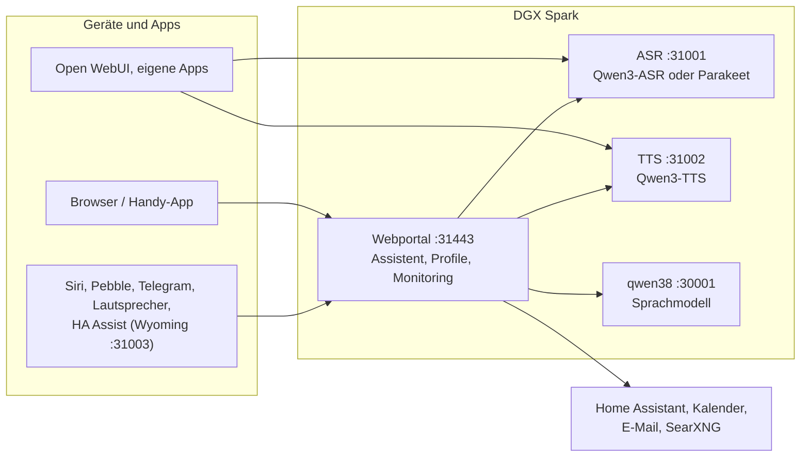

# Speech auf DGX Spark

[English](README.md) | **Deutsch** · Idee: Dominik Bornhäußer

Spracherkennung (**Qwen3-ASR**) und Sprachausgabe (**Qwen3-TTS**) als Dienste auf einer NVIDIA DGX Spark (GB10), dazu ein Webportal mit Sprach-Assistent, Profilen und Monitoring. Läuft nativ mit systemd, ohne Docker, neben [dgx-spark-qwen38](https://github.com/hasso5703/dgx-spark-qwen38), das das Sprachmodell liefert.

## Installation

```bash
git clone https://github.com/db9979/speech-on-dgx-spark
cd speech-on-dgx-spark
sudo ./install.sh
```

Das Skript fragt, was installiert werden soll:

- **Komplett**: Modelle, APIs und das Webportal mit dem Assistenten.
- **Nur die Modelle mit ihren APIs**: für Open WebUI, eigene Apps oder Home Assistant, ohne Portal. Verwaltet wird dann mit `sudo speech-spark`.

Am Ende stehen Adresse, Passwort und API-Schlüssel auf dem Bildschirm, danach spricht die Sprachausgabe einen Satz und die Spracherkennung prüft ihn. Das Portal liegt auf `https://SPARK:31443` (https ist nötig, damit der Browser das Mikrofon freigibt).

| Aufgabe | Befehl |
|---|---|
| Aktualisieren | Knopf im Portal unter *Einstellungen → Update und Sicherung* oder `sudo speech-spark update` |
| Adressen und Schlüssel anzeigen | `sudo speech-spark info` |
| Deinstallieren | `sudo ./uninstall.sh` (Konfiguration, Modelle und Stimmen bleiben; `--purge` löscht alles) |

Alle Optionen ohne Rückfragen (`--mode api --asr 1.7b --tts 0.6b --yes` …) stehen in [Installation im Detail](docs/de/installation.md).

## Letzte Änderungen

<!-- New version: add one line at the top here and in CHANGELOG.md, drop the oldest line here (keep 10). Details go to docs/de and docs/en, not into this README. -->

- **V01.0.285** Spark verwalten: der Knopf oben (und „Admin-Anmeldung“ im Handy-Menü) nur noch für Profile mit Admin-Rolle, nicht für Gäste und normale Profile; Anmeldung mit dem Panel-Passwort über die Adresse mit #admin am Ende
- **V01.0.284** Vorrang für Personen, Teil 2: Solange eine Antwort mit Vorrang ihren ersten Satz nicht hat, warten neue Anfragen anderer ans Sprachmodell höchstens 2 s (einstellbar 0–5, laufende nie abgebrochen); Browser und iPhone-App melden den Aufnahmebeginn, dann stoppt Hintergrundarbeit sofort; Logs → Anfragen zeigt die Wartezeit
- **V01.0.283** Neue Personen: angenommene Einladungen verschwinden 7 Tage nach der Annahme oder sofort mit dem gelöschten Profil (auch seine PIN-Links); Reste schon gelöschter Profile räumt die Liste beim Öffnen weg
- **V01.0.282** Vorrang für Personen (Funktionen → Gespräch, aus; Stufe pro Profil nur vom Admin unter Personen und Geräte, höchstens 3): Sätze und Aufnahmen mit Vorrang überholen in Sprachausgabe und Spracherkennung die wartenden anderer (laufende nie abgebrochen, niemand verhungert), nur das Panel darf die Stufe sagen; Logs → Anfragen zeigt Wartezeit, Zustand → Prüfen misst „Zwei Personen gleichzeitig“
- **V01.0.281** Mein Zustand (Funktionen → Alltag, aus; Ich → Mein Zustand): was der Spark im Hintergrund für dich erledigt (Dokumente lesen, Bedeutungssuche, Steckbriefe, reMarkable, Postfach aufräumen, Kontakte, Aufträge, Morgenbriefing, Gedächtnis) mit Wartegrund, zuletzt/nächstes Mal und 7-Tage-Verlauf, dazu verbundene Dienste mit ihrer letzten Antwort; roter Punkt bei „Ich“, wenn dich etwas braucht; nur Namen und Zahlen; iPhone-App liest dieselbe Quelle, Admin sieht nur Anzahlen
- **V01.0.280** „Los geht's“: Speichern des Einrichtungsstands lädt die Seite nicht mehr neu (Schalter-Prüfung übersprungen); Browsertest schreibt eine Diagnose statt zu hängen
- **V01.0.279** reMarkable: „… und leg es aufs reMarkable“ legt die ganze Antwort ab, auch nach einer Websuche; eine feste Regel auf den eigenen Worten entscheidet, das Panel schickt nach der Antwort und sagt Bescheid (vorher schnitt die Weiche das Werkzeug weg)
- **V01.0.278** Update-Log ohne pip-Fehler „dependency conflicts“: rmscene (reMarkable) kommt ohne seine Abhängigkeiten, packaging bleibt aktuell (vorher auf 23.2 herabgestuft, wheel kaputt); bestehende Installationen werden beim Update repariert
- **V01.0.277** iPhone-App: erste Antwort mit Ton (Tonweg-Wechsel nach dem Start abgewartet, verworfene Stücke nachgespielt), „Ton-Protokoll kopieren“ in den Einstellungen
- **V01.0.276** Neue Personen per Einladung (Personen und Geräte → Neue Personen, aus): Link, QR-Code oder Karte, einmal gültig, Startpakete „Familie“/„Gast plus“, zweiter Anmeldeschritt Pflicht für E-Mail, Dokumente und Aufträge; danach führt Ich → „Los geht's“ durch Geräte und Dienste (Spark hakt selbst ab), „Am Handy weitermachen“ per QR-Code mit Zahlenabgleich, PIN-Link und Erinnern in den Profil-Details, iPhone-App nimmt Einladungen an

Alle Versionen: [CHANGELOG.md](CHANGELOG.md)

## So funktioniert es



1. Du sprichst ins Handy oder in den Browser. Das Portal schickt den Ton an die **Spracherkennung**, die Text daraus macht.
2. Das Portal gibt den Text mit Gedächtnis, Gesprächsverlauf und den erlaubten Werkzeugen an das **Sprachmodell** von qwen38.
3. Braucht die Antwort Kalender, Mail, Wetter, Websuche oder Home Assistant, holt das Portal die Daten selbst; schalten und eintragen geht nur nach Bestätigung.
4. Die Antwort geht Satz für Satz an die **Sprachausgabe** und wird gestreamt abgespielt, während das Modell noch schreibt.
5. Andere Apps können ASR und TTS auch direkt über die OpenAI-ähnlichen APIs nutzen, mit API-Schlüssel.

Jede Funktion ist pro Profil einzeln schaltbar und ab Werk aus. Updates laufen erst nach grünem Selbsttest und lassen sich zurücknehmen.

## Weiterlesen

- [Installation im Detail](docs/de/installation.md): Installationsarten, Befehl `speech-spark`, alle Optionen, Update, Deinstallieren
- [Assistent und Oberfläche](docs/de/assistent.md): Sprach-Chat, Handy, Funktionen, Menü
- [APIs und Einbinden](docs/de/apis-und-einbinden.md): Transkription, Sprachausgabe, Streaming, Open WebUI, Siri, Pebble
- [Sicherheit und Betrieb](docs/de/sicherheit-und-betrieb.md): Anmeldung, Sperren, Sicherungen, Wächter, Selbsttest, Logs
- [Technik und Fehlersuche](docs/de/technik.md): Dienste und Ports, Leistung messen, neben qwen38, Fehlersuche

Im Portal steht zu jeder Funktion eine eigene Anleitung unter *Einbinden → Anleitungen*.

## Lizenz

MIT, siehe [LICENSE](LICENSE). Die Modelle (Qwen3-ASR, Qwen3-TTS) und Pakete (vLLM, vllm-omni, PyTorch) werden bei der Installation geladen und stehen unter ihren eigenen Lizenzen. Dieses Projekt steht in keiner Verbindung zu NVIDIA oder dem Qwen-Team.
