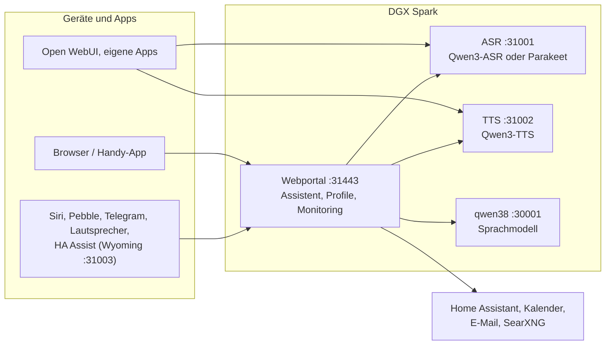

# Speech auf DGX Spark

[English](README.md) | **Deutsch** · Idee: Dominik Bornhäußer

Spracherkennung (**Qwen3-ASR**) und Sprachausgabe (**Qwen3-TTS**) als Dienste auf einer NVIDIA DGX Spark (GB10), dazu ein Webportal mit Sprach-Assistent, Profilen und Monitoring. Läuft nativ mit systemd, ohne Docker, neben [dgx-spark-qwen38](https://github.com/hasso5703/dgx-spark-qwen38), das das Sprachmodell liefert.

## Installation

```bash
git clone https://github.com/db9979/speech-on-dgx-spark
cd speech-on-dgx-spark
sudo ./install.sh
```

Das Skript fragt, was installiert werden soll:

- **Komplett**: Modelle, APIs und das Webportal mit dem Assistenten.
- **Nur die Modelle mit ihren APIs**: für Open WebUI, eigene Apps oder Home Assistant, ohne Portal. Verwaltet wird dann mit `sudo speech-spark`.

Am Ende stehen Adresse, Passwort und API-Schlüssel auf dem Bildschirm, danach spricht die Sprachausgabe einen Satz und die Spracherkennung prüft ihn. Das Portal liegt auf `https://SPARK:31443` (https ist nötig, damit der Browser das Mikrofon freigibt).

| Aufgabe | Befehl |
|---|---|
| Aktualisieren | Knopf im Portal unter *Einstellungen → Update und Sicherung* oder `sudo speech-spark update` |
| Adressen und Schlüssel anzeigen | `sudo speech-spark info` |
| Deinstallieren | `sudo ./uninstall.sh` (Konfiguration, Modelle und Stimmen bleiben; `--purge` löscht alles) |

Alle Optionen ohne Rückfragen (`--mode api --asr 1.7b --tts 0.6b --yes` …) stehen in [Installation im Detail](docs/de/installation.md).

## Letzte Änderungen

<!-- New version: add one line at the top here and in CHANGELOG.md, drop the oldest line here (keep 10). Details go to docs/de and docs/en, not into this README. -->

- **V01.0.270** Vereinheitlichen Phase 4: ein Zeilen-Baustein (setRow) für alle Einstellungen, vom Admin Ausgeschaltetes bleibt unter Ich sichtbar mit Grund, Ich nennt nicht eingeschaltete Funktionen, Spalte „Neue Profile“ unter Wer darf was, Vorgaben nehmen nie einen Funktionsschalter ein
- **V01.0.269** Vereinheitlichen Phase 3: Funktionen → „Wer darf was“ (Spark, jedes Profil, Gäste; Filter Neu/Braucht dich; Handy mit Profil-Chips), Admin schaltet Profilschalter mit Eintrag im Admin-Protokoll, auch für Verwalter
- **V01.0.268** Vereinheitlichen Phase 2: Standardwerte nur noch aus config.default.json (load_config füllt fehlende Schlüssel), Vorgaben und eigene Werte nur über profiles.effective; Selbsttest gegen zweite Standardwerte und Handmischungen
- **V01.0.267** Vereinheitlichen Phase 0–1: jede Funktion einmal in features.py, eine Prüfung „Spark an, Profil an“ für alle Module, /api/features mit Grund; Lücken geschlossen (Korrekturen lernen braucht das Gedächtnis, Push und Update brauchen die iPhone-App, Raum aus der Ferne braucht Lautsprecher)
- **V01.0.266** Kiwix: „Schau in deinem/unserem Archiv“ und „im Archiv“ werden erkannt, die erste Runde muss dann das Archiv fragen statt der hochgeladenen Dokumente
- **V01.0.265** Bedienung: Funktionen eigener Menüpunkt (mit Anleitungen), „Personen und Geräte“ (mit Apps und Schnittstellen), „Einbinden“ entfällt; Suche Strg K/⌘ K über Seiten, Schalter, Einstellungen, Ich, Prüfen, Logs und Anleitungen
- **V01.0.264** Erst lokal suchen (Funktionen → Websuche, aus; Profil-Schalter): Wissensfragen schauen zuerst in Dokumenten, Kiwix-Archiv und früheren Gesprächen (höchstens 400 ms, Treffer als Daten mit Quelle), Aktuelles geht direkt hinaus, „in meinen Unterlagen“ bleibt lokal; Websuche nach Dokumenten nur mit den Worten der Frage; Zustand → Prüfen → „Erst lokal testen“, Logzeile „lokal:“
- **V01.0.263** Logs → Anfragen (Schalter unter Einstellungen → Betrieb, aus): Weg jeder Anfrage als Liste mit Perlenkette und Zeitstrahl (Weiche, Sprachmodell-Runden, Werkzeuge, Prüfung, Sprachausgabe, erster Ton), ohne Frage- und Antworttext; Name nur mit Zustimmung des Profils
- **V01.0.262** Sicherheit: Schutz-Kopfzeilen auf jeder Antwort (kein Einbetten in fremde Seiten, nosniff, Referrer-Policy, Mikrofon/Kamera nur fürs Panel, HSTS auf https), Liste der angemeldeten Browser mit Einzel-Abmelden (Ich → Sicherheit, Admin in den Profil-Details), Profil-Anmeldung endet nach 30 Tagen ohne Nutzung (7–90 einstellbar), „Sicherheit auf einen Blick“ als Ampel oben unter Einstellungen → Sicherheit
- **V01.0.261** Kiwix: Bücher werden ohne Datum gespeichert, aktualisierte Dateien bleiben gewählt (neueste wird genommen, Katalog bei 404 neu gelesen); „Schau in meinem Archiv“ sucht nie in den hochgeladenen Dokumenten und sagt, welcher Schalter fehlt

Alle Versionen: [CHANGELOG.md](CHANGELOG.md)

## So funktioniert es



1. Du sprichst ins Handy oder in den Browser. Das Portal schickt den Ton an die **Spracherkennung**, die Text daraus macht.
2. Das Portal gibt den Text mit Gedächtnis, Gesprächsverlauf und den erlaubten Werkzeugen an das **Sprachmodell** von qwen38.
3. Braucht die Antwort Kalender, Mail, Wetter, Websuche oder Home Assistant, holt das Portal die Daten selbst; schalten und eintragen geht nur nach Bestätigung.
4. Die Antwort geht Satz für Satz an die **Sprachausgabe** und wird gestreamt abgespielt, während das Modell noch schreibt.
5. Andere Apps können ASR und TTS auch direkt über die OpenAI-ähnlichen APIs nutzen, mit API-Schlüssel.

Jede Funktion ist pro Profil einzeln schaltbar und ab Werk aus. Updates laufen erst nach grünem Selbsttest und lassen sich zurücknehmen.

## Weiterlesen

- [Installation im Detail](docs/de/installation.md): Installationsarten, Befehl `speech-spark`, alle Optionen, Update, Deinstallieren
- [Assistent und Oberfläche](docs/de/assistent.md): Sprach-Chat, Handy, Funktionen, Menü
- [APIs und Einbinden](docs/de/apis-und-einbinden.md): Transkription, Sprachausgabe, Streaming, Open WebUI, Siri, Pebble
- [Sicherheit und Betrieb](docs/de/sicherheit-und-betrieb.md): Anmeldung, Sperren, Sicherungen, Wächter, Selbsttest, Logs
- [Technik und Fehlersuche](docs/de/technik.md): Dienste und Ports, Leistung messen, neben qwen38, Fehlersuche

Im Portal steht zu jeder Funktion eine eigene Anleitung unter *Einbinden → Anleitungen*.

## Lizenz

MIT, siehe [LICENSE](LICENSE). Die Modelle (Qwen3-ASR, Qwen3-TTS) und Pakete (vLLM, vllm-omni, PyTorch) werden bei der Installation geladen und stehen unter ihren eigenen Lizenzen. Dieses Projekt steht in keiner Verbindung zu NVIDIA oder dem Qwen-Team.
