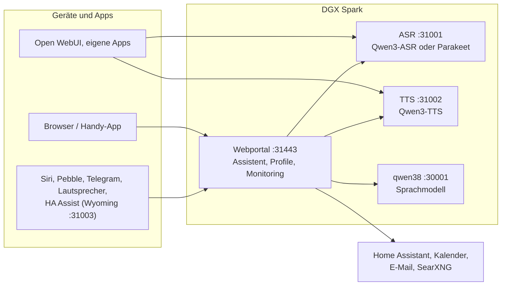

# Speech auf DGX Spark

[English](README.md) | **Deutsch** · Idee: Dominik Bornhäußer

Spracherkennung (**Qwen3-ASR**) und Sprachausgabe (**Qwen3-TTS**) als Dienste auf einer NVIDIA DGX Spark (GB10), dazu ein Webportal mit Sprach-Assistent, Profilen und Monitoring. Läuft nativ mit systemd, ohne Docker, neben [dgx-spark-qwen38](https://github.com/hasso5703/dgx-spark-qwen38), das das Sprachmodell liefert.

## Installation

```bash
git clone https://github.com/db9979/speech-on-dgx-spark
cd speech-on-dgx-spark
sudo ./install.sh
```

Das Skript fragt, was installiert werden soll:

- **Komplett**: Modelle, APIs und das Webportal mit dem Assistenten.
- **Nur die Modelle mit ihren APIs**: für Open WebUI, eigene Apps oder Home Assistant, ohne Portal. Verwaltet wird dann mit `sudo speech-spark`.

Am Ende stehen Adresse, Passwort und API-Schlüssel auf dem Bildschirm, danach spricht die Sprachausgabe einen Satz und die Spracherkennung prüft ihn. Das Portal liegt auf `https://SPARK:31443` (https ist nötig, damit der Browser das Mikrofon freigibt).

| Aufgabe | Befehl |
|---|---|
| Aktualisieren | Knopf im Portal unter *Einstellungen → Update und Sicherung* oder `sudo speech-spark update` |
| Adressen und Schlüssel anzeigen | `sudo speech-spark info` |
| Deinstallieren | `sudo ./uninstall.sh` (Konfiguration, Modelle und Stimmen bleiben; `--purge` löscht alles) |

Alle Optionen ohne Rückfragen (`--mode api --asr 1.7b --tts 0.6b --yes` …) stehen in [Installation im Detail](docs/de/installation.md).

## Letzte Änderungen

<!-- New version: add one line at the top here and in CHANGELOG.md, drop the oldest line here (keep 10). Details go to docs/de and docs/en, not into this README. -->

- **V01.0.233** iPhone-App: erste Antwort nach dem Start wieder mit Ton (Wiedergabe startet nach dem Einschalten der Echounterdrückung neu)
- **V01.0.232** Ich → Dokumente zeigt den Fortschritt pro Dokument: „Seite 3 von 12 gelesen“ mit Balken und Grund (liest gerade Seite …, wartet auf eine ruhige Minute, Tagesgrenze, Schalter aus), danach „Bedeutung 40 von 120“; die Liste aktualisiert sich alle 10 s, solange etwas läuft; iPhone-App zeigt „Seite x von y gelesen“
- **V01.0.231** „Vorrang prüfen“ misst den Fall mit Vorfahrt wie ein echtes Gespräch (erst Erkennung, dann Sprachausgabe)
- **V01.0.230** Pebble-Uhr zuverlässiger und Gesicht wie im Web: Uhr wiederholt fehlgeschlagene Nachrichten, gibt nach 30 s ohne Antwort auf, meldet den Puffer fortlaufend (verlorene Meldung stoppt den Ton nicht mehr), alte Antworten werden verworfen; Handy schickt Text vor Ton, größere Tonstücke (3,8 KB), wiederholt statt still zu verlieren; pro Antwort eine Zeitzeile im Log (Bereich „Uhr“); neu und aus (Admin + Profil): „Pebble-Uhr koppeln“ mit Einrichtungscode aus Ich → Pebble-Uhr, eigener Uhr-Schlüssel nur für /api/watch/; die Uhr zeigt das im Panel gewählte Gesicht (Roboter oder Comic)
- **V01.0.229** Update auf tars klappt wieder: ein Selbsttest von .225 suchte install.sh, das beim Update-Selbsttest nicht dabei ist
- **V01.0.228** Zustand: Karte „Eigene Dokumente“ unter Zustand → Monitoring zeigt, ob das Bedeutungs-Modell läuft (mit Arbeitsspeicher), startet, auf freien Speicher wartet oder einen Fehler hat, wie viele Stücke schon eine Bedeutung haben und wie viele Seiten noch aufs Lesen warten (nur Zahlen, nur Admin, sichtbar wenn ein Schalter an ist)
- **V01.0.227** iPhone-App: „Meine Dokumente“ ansehen (PDF und Bilder in Apples Vorschau, sonst der gespeicherte Text)
- **V01.0.226** Fremde Stimme bekam am Lautsprecher die Mails des Inhabers: Persönliches (Mail, Termine, Erinnerungen, Gedächtnis, Dokumente, Smart Home …) gibt es am Lautsprecher nur noch für die sicher erkannte Stimme des Inhabers, sonst Gastrechte mit kurzem Hinweis (feste Regel, ohne Schalter); Logs → Lautsprecher zeigt jede abgewiesene Frage gelb mit Grund
- **V01.0.225** Sprache hat immer Vorrang: Hintergrundarbeit wartet, solange gesprochen wird, und ihre laufende Anfrage ans Sprachmodell wird abgebrochen und später wiederholt; ASR und TTS bekommen mehr CPU und Platte; Zustand → Prüfen → „Vorrang prüfen“ misst es (feste Regel, ohne Schalter)
- **V01.0.224** Wissen aus Uploads: Dokumente pro Profil in einer SQLite-Datei (alte werden übernommen, Sicherung konsistent), mehr Dateiarten (Excel, PowerPoint, OpenDocument, .eml), Dokumente ansehen (Text, Bilder und PDFs im Browser), pro Dokument an/aus, „Suche ausprobieren“, Quellen mit Seite anklickbar; neu und je aus (Admin + Profil): Bilder und Scans liest das Sprachmodell in Gesprächspausen ab (auch „Bild in Meine Dokumente“ im Chat, /merken in Telegram), Bedeutungssuche mit kleinem CPU-Modell in eigenem Prozess, Originale aufbewahren mit Speichergrenze; nach Dokumenten keine Websuche in derselben Antwort

Alle Versionen: [CHANGELOG.md](CHANGELOG.md)

## So funktioniert es



1. Du sprichst ins Handy oder in den Browser. Das Portal schickt den Ton an die **Spracherkennung**, die Text daraus macht.
2. Das Portal gibt den Text mit Gedächtnis, Gesprächsverlauf und den erlaubten Werkzeugen an das **Sprachmodell** von qwen38.
3. Braucht die Antwort Kalender, Mail, Wetter, Websuche oder Home Assistant, holt das Portal die Daten selbst; schalten und eintragen geht nur nach Bestätigung.
4. Die Antwort geht Satz für Satz an die **Sprachausgabe** und wird gestreamt abgespielt, während das Modell noch schreibt.
5. Andere Apps können ASR und TTS auch direkt über die OpenAI-ähnlichen APIs nutzen, mit API-Schlüssel.

Jede Funktion ist pro Profil einzeln schaltbar und ab Werk aus. Updates laufen erst nach grünem Selbsttest und lassen sich zurücknehmen.

## Weiterlesen

- [Installation im Detail](docs/de/installation.md): Installationsarten, Befehl `speech-spark`, alle Optionen, Update, Deinstallieren
- [Assistent und Oberfläche](docs/de/assistent.md): Sprach-Chat, Handy, Funktionen, Menü
- [APIs und Einbinden](docs/de/apis-und-einbinden.md): Transkription, Sprachausgabe, Streaming, Open WebUI, Siri, Pebble
- [Sicherheit und Betrieb](docs/de/sicherheit-und-betrieb.md): Anmeldung, Sperren, Sicherungen, Wächter, Selbsttest, Logs
- [Technik und Fehlersuche](docs/de/technik.md): Dienste und Ports, Leistung messen, neben qwen38, Fehlersuche

Im Portal steht zu jeder Funktion eine eigene Anleitung unter *Einbinden → Anleitungen*.

## Lizenz

MIT, siehe [LICENSE](LICENSE). Die Modelle (Qwen3-ASR, Qwen3-TTS) und Pakete (vLLM, vllm-omni, PyTorch) werden bei der Installation geladen und stehen unter ihren eigenen Lizenzen. Dieses Projekt steht in keiner Verbindung zu NVIDIA oder dem Qwen-Team.
