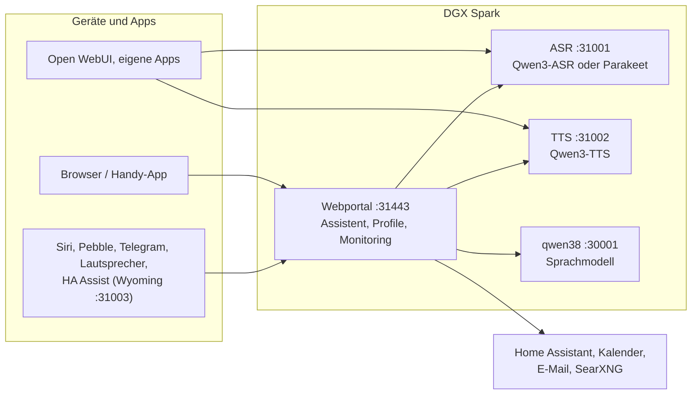

# Speech auf DGX Spark

[English](README.md) | **Deutsch** · Idee: Dominik Bornhäußer

Spracherkennung (**Qwen3-ASR**) und Sprachausgabe (**Qwen3-TTS**) als Dienste auf einer NVIDIA DGX Spark (GB10), dazu ein Webportal mit Sprach-Assistent, Profilen und Monitoring. Läuft nativ mit systemd, ohne Docker, neben [dgx-spark-qwen38](https://github.com/hasso5703/dgx-spark-qwen38), das das Sprachmodell liefert.

## Installation

```bash
git clone https://github.com/db9979/speech-on-dgx-spark
cd speech-on-dgx-spark
sudo ./install.sh
```

Das Skript fragt, was installiert werden soll:

- **Komplett**: Modelle, APIs und das Webportal mit dem Assistenten.
- **Nur die Modelle mit ihren APIs**: für Open WebUI, eigene Apps oder Home Assistant, ohne Portal. Verwaltet wird dann mit `sudo speech-spark`.

Am Ende stehen Adresse, Passwort und API-Schlüssel auf dem Bildschirm, danach spricht die Sprachausgabe einen Satz und die Spracherkennung prüft ihn. Das Portal liegt auf `https://SPARK:31443` (https ist nötig, damit der Browser das Mikrofon freigibt).

| Aufgabe | Befehl |
|---|---|
| Aktualisieren | Knopf im Portal unter *Zustand → System und Update* oder `sudo speech-spark update` |
| Adressen und Schlüssel anzeigen | `sudo speech-spark info` |
| Deinstallieren | `sudo ./uninstall.sh` (Konfiguration, Modelle und Stimmen bleiben; `--purge` löscht alles) |

Alle Optionen ohne Rückfragen (`--mode api --asr 1.7b --tts 0.6b --yes` …) stehen in [Installation im Detail](docs/de/installation.md).

## Letzte Änderungen

<!-- New version: add one line at the top here and in CHANGELOG.md, drop the oldest line here (keep 10). Details go to docs/de and docs/en, not into this README. -->

- **V01.0.145** Design „Klar“, Schritt 1: Menü am Rechner als Leiste links (Assistent, Ich, dann „Spark verwalten“ mit Zustand, Einstellungen, Profile und Geräte, Einbinden), am Handy als Leiste unten; „Übersicht“ heißt jetzt „Zustand“, Zahl ungespeicherter Einstellungsseiten im Menü
- **V01.0.144** Rückfrage ohne Weckwort (aus, Admin + Profil): nach der Antwort auf eine gesprochene Frage hört der Assistent noch 4–10 Sekunden zu, „Und morgen?“ braucht kein „Hey Spark“
- **V01.0.143** Freihändig hört auch dann wieder zu, wenn der Browser die Wiedergabe angehalten hat (iOS, kein Lautsprecher): „spricht noch“ gilt nur, wenn wirklich etwas abgespielt wird; GitHub-Test wieder grün
- **V01.0.142** Lautsprecher: „Stimme hier anlernen“ (drei Sätze, eigener Stimmabdruck fürs Board-Mikrofon); „nur bekannte Stimmen“ greift am Lautsprecher erst, wenn dort eine Stimme angelernt ist
- **V01.0.141** Web-Log mit Diagnose-Filtern: Übersicht → Logs → „Diagnose-Filter“ zeigt chat:, Websuche, Home Assistant, Raum-Modus, Lautsprecher, Update/Selbsttest und Fehler mit Zeitraum und Zeilenzahl, zum Kopieren in einen Thread (statt journalctl | grep auf der Konsole)
- **V01.0.140** Raum-Modus flinker und findet mehr Fragen: Lautsprecher schneidet Gespräch in kurze Stücke, spricht nach 1,5 s Stille, streamt die Stimme; Antwort wird schon gesucht, während noch geredet wird; Fragen auch ohne Fragezeichen und nach „Weißt du, …“; „Auch Kommentare“ gesprächiger
- **V01.0.139** Raum-Modus überhört Fernsehstimmen: pro Gerät „Wem er zuhört“ (allen / nur bekannte Stimmen, wenn der Fernseher läuft / immer nur bekannte Stimmen), mit Probelauf, der nur zählt; Admin-Schalter „Fernsehstimmen überhören“, standardmäßig aus
- **V01.0.138** Lautsprecher: keine Lücken mehr in langen Ansagen, neue Firmware 2.5.1.5 wartet bei vollem Tonpuffer, statt Ton wegzuwerfen; der Spark hält 0,7 s Vorlauf
- **V01.0.137** Lautsprecher: Ton stockt nicht mehr, der Spark puffert vor (0,6 s vor dem Start, bis 0,9 s Vorlauf, nach einem Hänger erst wieder 0,3 s sammeln); Hänger stehen unter „Prüfen“ und im Log
- **V01.0.136** Lautsprecher: „Prüfen“ zeigt live, was der Lautsprecher gerade tut (alle 2 Sekunden), auch im Raum-Modus (nur dass ein Satz gehört wurde und ob er spricht, nie den Text)

Alle Versionen: [CHANGELOG.md](CHANGELOG.md)

## So funktioniert es



1. Du sprichst ins Handy oder in den Browser. Das Portal schickt den Ton an die **Spracherkennung**, die Text daraus macht.
2. Das Portal gibt den Text mit Gedächtnis, Gesprächsverlauf und den erlaubten Werkzeugen an das **Sprachmodell** von qwen38.
3. Braucht die Antwort Kalender, Mail, Wetter, Websuche oder Home Assistant, holt das Portal die Daten selbst; schalten und eintragen geht nur nach Bestätigung.
4. Die Antwort geht Satz für Satz an die **Sprachausgabe** und wird gestreamt abgespielt, während das Modell noch schreibt.
5. Andere Apps können ASR und TTS auch direkt über die OpenAI-ähnlichen APIs nutzen, mit API-Schlüssel.

Jede Funktion ist pro Profil einzeln schaltbar und ab Werk aus. Updates laufen erst nach grünem Selbsttest und lassen sich zurücknehmen.

## Weiterlesen

- [Installation im Detail](docs/de/installation.md): Installationsarten, Befehl `speech-spark`, alle Optionen, Update, Deinstallieren
- [Assistent und Oberfläche](docs/de/assistent.md): Sprach-Chat, Handy, Funktionen, Menü
- [APIs und Einbinden](docs/de/apis-und-einbinden.md): Transkription, Sprachausgabe, Streaming, Open WebUI, Siri, Pebble
- [Sicherheit und Betrieb](docs/de/sicherheit-und-betrieb.md): Anmeldung, Sperren, Sicherungen, Wächter, Selbsttest, Logs
- [Technik und Fehlersuche](docs/de/technik.md): Dienste und Ports, Leistung messen, neben qwen38, Fehlersuche

Im Portal steht zu jeder Funktion eine eigene Anleitung unter *Einbinden → Anleitungen*.

## Lizenz

MIT, siehe [LICENSE](LICENSE). Die Modelle (Qwen3-ASR, Qwen3-TTS) und Pakete (vLLM, vllm-omni, PyTorch) werden bei der Installation geladen und stehen unter ihren eigenen Lizenzen. Dieses Projekt steht in keiner Verbindung zu NVIDIA oder dem Qwen-Team.
