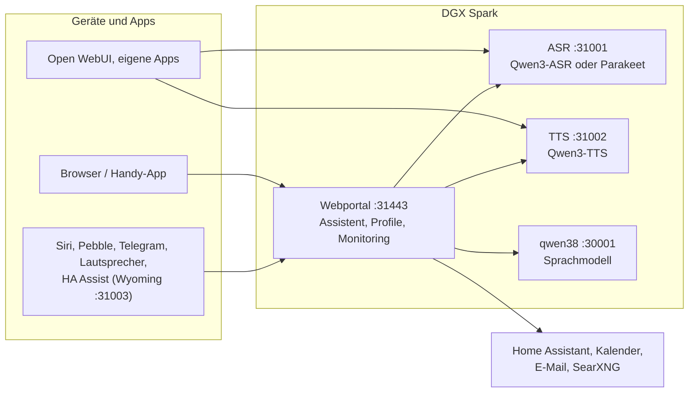

# Speech auf DGX Spark

[English](README.md) | **Deutsch** · Idee: Dominik Bornhäußer

Spracherkennung (**Qwen3-ASR**) und Sprachausgabe (**Qwen3-TTS**) als Dienste auf einer NVIDIA DGX Spark (GB10), dazu ein Webportal mit Sprach-Assistent, Profilen und Monitoring. Läuft nativ mit systemd, ohne Docker, neben [dgx-spark-qwen38](https://github.com/hasso5703/dgx-spark-qwen38), das das Sprachmodell liefert.

## Installation

```bash
git clone https://github.com/db9979/speech-on-dgx-spark
cd speech-on-dgx-spark
sudo ./install.sh
```

Das Skript fragt, was installiert werden soll:

- **Komplett**: Modelle, APIs und das Webportal mit dem Assistenten.
- **Nur die Modelle mit ihren APIs**: für Open WebUI, eigene Apps oder Home Assistant, ohne Portal. Verwaltet wird dann mit `sudo speech-spark`.

Am Ende stehen Adresse, Passwort und API-Schlüssel auf dem Bildschirm, danach spricht die Sprachausgabe einen Satz und die Spracherkennung prüft ihn. Das Portal liegt auf `https://SPARK:31443` (https ist nötig, damit der Browser das Mikrofon freigibt).

| Aufgabe | Befehl |
|---|---|
| Aktualisieren | Knopf im Portal unter *Übersicht → System und Update* oder `sudo speech-spark update` |
| Adressen und Schlüssel anzeigen | `sudo speech-spark info` |
| Deinstallieren | `sudo ./uninstall.sh` (Konfiguration, Modelle und Stimmen bleiben; `--purge` löscht alles) |

Alle Optionen ohne Rückfragen (`--mode api --asr 1.7b --tts 0.6b --yes` …) stehen in [Installation im Detail](docs/de/installation.md).

## Letzte Änderungen

<!-- New version: add one line at the top here and in CHANGELOG.md, drop the oldest line here (keep 10). Details go to docs/de and docs/en, not into this README. -->

- **V01.0.134** Lautsprecher: leise Mikrofone (Boards mit Audio-Chip wie das Waveshare-Board) zählen jetzt als Sprache, leise Aufnahmen werden vor der Spracherkennung angehoben, und der Mikrofonpegel steht im Log
- **V01.0.133** Lautsprecher: Firmware für das Waveshare ESP32-S3-AUDIO-Board (Audio-Chip ES8311, zwei Mikrofone), und Updates folgen der Board-Art, die per USB zuletzt geschrieben wurde
- **V01.0.132** Lautsprecher ohne Display: Absturz direkt nach dem WLAN behoben (die Firmware wollte Schrift und Emojis auf einen nicht vorhandenen Bildschirm laden), neue Firmware 2.5.1.3
- **V01.0.131** Lautsprecher prüfen: unter Ich → Lautsprecher zeigt „Prüfen“ Schalter, Adresse, letzte Meldungen und Mikrofonpegel, „Netz prüfen“ testet Adresse, Zertifikat und WebSocket, „Test“ spielt Ton und Satz und prüft das Mikrofon, und das Board-Protokoll lässt sich per USB im Browser lesen
- **V01.0.130** Websuche fehlt nie mehr still: nach einer Antwort aus Mails sucht eine klare Suchfrage wieder, „such im Internet“ oder „google mal“ führt immer über die Suche, sonst sagt der Assistent, warum er gerade nicht sucht
- **V01.0.129** iPhone/Safari: Freihändig bleibt an, wenn iOS das Mikrofon beendet (gesperrter Bildschirm, Anruf, Siri): neues Mikrofon statt totem, öffnet sich wieder, sobald die Seite offen ist, und sagt, warum es aus war
- **V01.0.128** Raum-Modus auch auf den ESP32-Lautsprechern (alle Board-Varianten): „Raummodus an/aus“ per Sprache oder Schalter „Raum“ unter Ich → Lautsprecher, Dauer und Raum pro Lautsprecher, schweigt in den Ruhezeiten
- **V01.0.127** Suche in den Einstellungen und im Ich-Fenster (öffnet die Seite und markiert die Stelle); Browser-Test für alle Seiten am Rechner und am Handy, läuft auf GitHub bei jedem Push
- **V01.0.126** Raum-Modus: in den Ruhezeiten nur als Text, endet nach 2 Minuten im Hintergrund oder bei gesperrtem Handy, „Raummodus aus“ per Sprache
- **V01.0.125** Neue Menüs: Einstellungen in drei Blöcken, alles Prüfen unter Übersicht → Prüfen, Einbinden = Anleitungen + Apps und Schnittstellen, Ich-Fenster in den Gruppen der Funktionen-Seite mit Überblick und eigener Seite Mitteilungen

Alle Versionen: [CHANGELOG.md](CHANGELOG.md)

## So funktioniert es



1. Du sprichst ins Handy oder in den Browser. Das Portal schickt den Ton an die **Spracherkennung**, die Text daraus macht.
2. Das Portal gibt den Text mit Gedächtnis, Gesprächsverlauf und den erlaubten Werkzeugen an das **Sprachmodell** von qwen38.
3. Braucht die Antwort Kalender, Mail, Wetter, Websuche oder Home Assistant, holt das Portal die Daten selbst; schalten und eintragen geht nur nach Bestätigung.
4. Die Antwort geht Satz für Satz an die **Sprachausgabe** und wird gestreamt abgespielt, während das Modell noch schreibt.
5. Andere Apps können ASR und TTS auch direkt über die OpenAI-ähnlichen APIs nutzen, mit API-Schlüssel.

Jede Funktion ist pro Profil einzeln schaltbar und ab Werk aus. Updates laufen erst nach grünem Selbsttest und lassen sich zurücknehmen.

## Weiterlesen

- [Installation im Detail](docs/de/installation.md): Installationsarten, Befehl `speech-spark`, alle Optionen, Update, Deinstallieren
- [Assistent und Oberfläche](docs/de/assistent.md): Sprach-Chat, Handy, Funktionen, Menü
- [APIs und Einbinden](docs/de/apis-und-einbinden.md): Transkription, Sprachausgabe, Streaming, Open WebUI, Siri, Pebble
- [Sicherheit und Betrieb](docs/de/sicherheit-und-betrieb.md): Anmeldung, Sperren, Sicherungen, Wächter, Selbsttest, Logs
- [Technik und Fehlersuche](docs/de/technik.md): Dienste und Ports, Leistung messen, neben qwen38, Fehlersuche

Im Portal steht zu jeder Funktion eine eigene Anleitung unter *Einbinden → Anleitungen*.

## Lizenz

MIT, siehe [LICENSE](LICENSE). Die Modelle (Qwen3-ASR, Qwen3-TTS) und Pakete (vLLM, vllm-omni, PyTorch) werden bei der Installation geladen und stehen unter ihren eigenen Lizenzen. Dieses Projekt steht in keiner Verbindung zu NVIDIA oder dem Qwen-Team.
