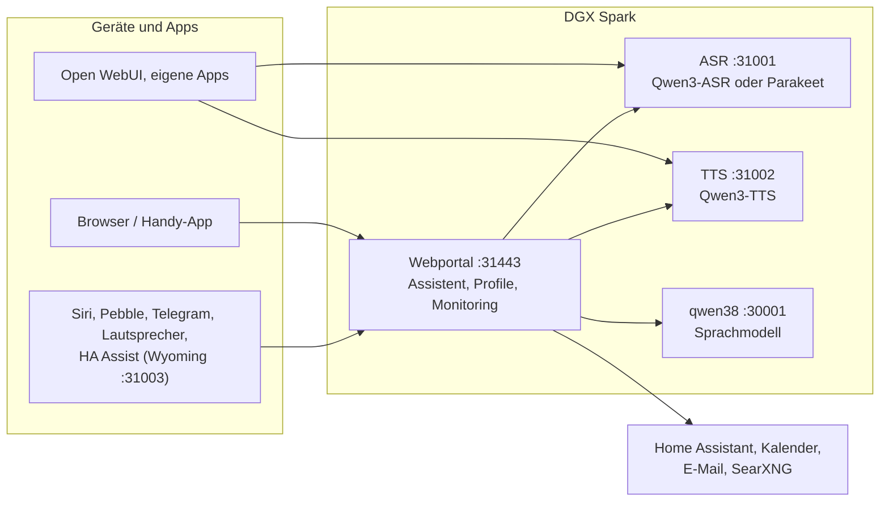

# Speech auf DGX Spark

[English](README.md) | **Deutsch** · Idee: Dominik Bornhäußer

Spracherkennung (**Qwen3-ASR**) und Sprachausgabe (**Qwen3-TTS**) als Dienste auf einer NVIDIA DGX Spark (GB10), dazu ein Webportal mit Sprach-Assistent, Profilen und Monitoring. Läuft nativ mit systemd, ohne Docker, neben [dgx-spark-qwen38](https://github.com/hasso5703/dgx-spark-qwen38), das das Sprachmodell liefert.

## Installation

```bash
git clone https://github.com/db9979/speech-on-dgx-spark
cd speech-on-dgx-spark
sudo ./install.sh
```

Das Skript fragt, was installiert werden soll:

- **Komplett**: Modelle, APIs und das Webportal mit dem Assistenten.
- **Nur die Modelle mit ihren APIs**: für Open WebUI, eigene Apps oder Home Assistant, ohne Portal. Verwaltet wird dann mit `sudo speech-spark`.

Am Ende stehen Adresse, Passwort und API-Schlüssel auf dem Bildschirm, danach spricht die Sprachausgabe einen Satz und die Spracherkennung prüft ihn. Das Portal liegt auf `https://SPARK:31443` (https ist nötig, damit der Browser das Mikrofon freigibt).

| Aufgabe | Befehl |
|---|---|
| Aktualisieren | Knopf im Portal unter *Übersicht → System und Update* oder `sudo speech-spark update` |
| Adressen und Schlüssel anzeigen | `sudo speech-spark info` |
| Deinstallieren | `sudo ./uninstall.sh` (Konfiguration, Modelle und Stimmen bleiben; `--purge` löscht alles) |

Alle Optionen ohne Rückfragen (`--mode api --asr 1.7b --tts 0.6b --yes` …) stehen in [Installation im Detail](docs/de/installation.md).

## Letzte Änderungen

<!-- New version: add one line at the top here and in CHANGELOG.md, drop the oldest line here (keep 10). Details go to docs/de and docs/en, not into this README. -->

- **V01.0.123** Einstellungen aufgeräumt: jede Einstellung direkt unter ihrem Schalter (Websuche, Wetter, Sprechererkennung; Seite „Websuche“ entfällt), kurze Funktionen mit Kennzeichen, Seiten heißen Sprachmodell, Vorgaben, Betrieb, überall „Ich“, Warnung bei ungespeicherten Änderungen
- **V01.0.122** Geklonte Stimmen jetzt unter Einstellungen → Stimmen (mit „Probe sprechen“); Menüpunkt „Nutzer“ heißt jetzt „Profile“; Ich → Stimme heißt jetzt „Sprechererkennung“
- **V01.0.121** Einstellungen fürs Sprachmodell: Verlaufslänge, Websuchen, Zeitlimit, top_p/presence_penalty, eigene Stichwörter für die Werkzeugpflicht, Prompt-Vorschau mit Standard-Knopf, eigener Gesprächsstil pro Profil (aus); Regeln bleiben fest
- **V01.0.120** Nach einem Update lädt der Browser die neue Version von selbst (Dateien mit Versions-Kennung, offene Seite lädt neu, wenn kein Gespräch läuft); kein Strg+F5 mehr
- **V01.0.119** Qualitätstest: neu kaputte Fragen erscheinen eine Woche lang als Hinweis oben auf jeder Admin-Seite
- **V01.0.118** Aus Korrekturen lernen (aus, Admin + Profil): nach „Nein, …“ fragt der Assistent „Soll ich mir merken …?“ und speichert erst nach „Ja“; korrigierte Fragen können als Testfall in den Qualitätstest
- **V01.0.117** Werkzeugpflicht per Tabelle, Antwort-Prüfung hält erfundene Uhrzeiten, Daten, Spielstände und Beträge zurück, Temperatur 0.1 bei der Werkzeugwahl, Qualitätstest mit Umformulierungen, Wiederholung und Verlauf, optional Nachdenken bei der Werkzeugwahl
- **V01.0.116** Selbsttest beim Update repariert: ein neuer Test sprach auf dem Spark die laufende TTS-Engine an (Event loop is closed)
- **V01.0.115** Sicherheit Stufe 6: Selbsttest-Scanner lehnt neuen Code mit shell=True/eval, Routen ohne Anmeldung, Uploads ohne Grenze, unmaskierte onclick-Werte und uneingeordnete Assistenten-Werkzeuge ab
- **V01.0.114** Sicherheit Stufe 5: Admin-Abmelden beendet alle Kopien, Admin überall abmelden, Codewort-Nachricht in Telegram gelöscht, Aufräumen nur bei exaktem Absender, gefälschte Paketmails ignoriert, Fehler und Dienst-Details nicht für Gäste

Alle Versionen: [CHANGELOG.md](CHANGELOG.md)

## So funktioniert es



1. Du sprichst ins Handy oder in den Browser. Das Portal schickt den Ton an die **Spracherkennung**, die Text daraus macht.
2. Das Portal gibt den Text mit Gedächtnis, Gesprächsverlauf und den erlaubten Werkzeugen an das **Sprachmodell** von qwen38.
3. Braucht die Antwort Kalender, Mail, Wetter, Websuche oder Home Assistant, holt das Portal die Daten selbst; schalten und eintragen geht nur nach Bestätigung.
4. Die Antwort geht Satz für Satz an die **Sprachausgabe** und wird gestreamt abgespielt, während das Modell noch schreibt.
5. Andere Apps können ASR und TTS auch direkt über die OpenAI-ähnlichen APIs nutzen, mit API-Schlüssel.

Jede Funktion ist pro Profil einzeln schaltbar und ab Werk aus. Updates laufen erst nach grünem Selbsttest und lassen sich zurücknehmen.

## Weiterlesen

- [Installation im Detail](docs/de/installation.md): Installationsarten, Befehl `speech-spark`, alle Optionen, Update, Deinstallieren
- [Assistent und Oberfläche](docs/de/assistent.md): Sprach-Chat, Handy, Funktionen, Menü
- [APIs und Einbinden](docs/de/apis-und-einbinden.md): Transkription, Sprachausgabe, Streaming, Open WebUI, Siri, Pebble
- [Sicherheit und Betrieb](docs/de/sicherheit-und-betrieb.md): Anmeldung, Sperren, Sicherungen, Wächter, Selbsttest, Logs
- [Technik und Fehlersuche](docs/de/technik.md): Dienste und Ports, Leistung messen, neben qwen38, Fehlersuche

Im Portal steht zu jeder Funktion eine eigene Anleitung unter *Einbinden → Anleitungen*.

## Lizenz

MIT, siehe [LICENSE](LICENSE). Die Modelle (Qwen3-ASR, Qwen3-TTS) und Pakete (vLLM, vllm-omni, PyTorch) werden bei der Installation geladen und stehen unter ihren eigenen Lizenzen. Dieses Projekt steht in keiner Verbindung zu NVIDIA oder dem Qwen-Team.
