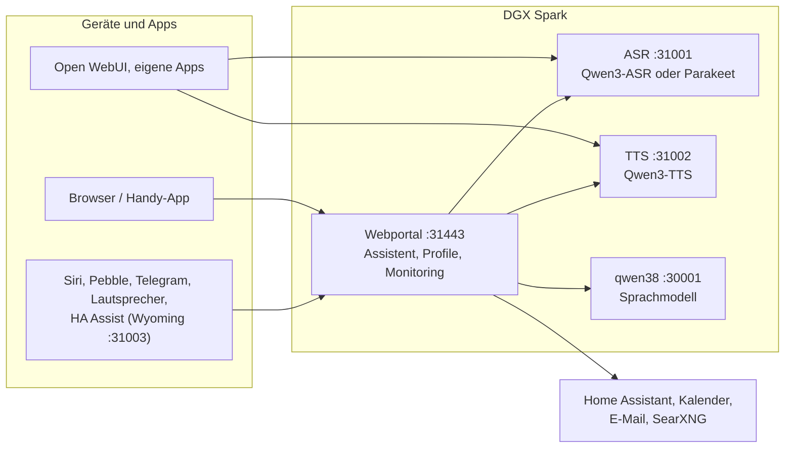

# Speech auf DGX Spark

[English](README.md) | **Deutsch** · Idee: Dominik Bornhäußer

Spracherkennung (**Qwen3-ASR**) und Sprachausgabe (**Qwen3-TTS**) als Dienste auf einer NVIDIA DGX Spark (GB10), dazu ein Webportal mit Sprach-Assistent, Profilen und Monitoring. Läuft nativ mit systemd, ohne Docker, neben [dgx-spark-qwen38](https://github.com/hasso5703/dgx-spark-qwen38), das das Sprachmodell liefert.

## Installation

```bash
git clone https://github.com/db9979/speech-on-dgx-spark
cd speech-on-dgx-spark
sudo ./install.sh
```

Das Skript fragt, was installiert werden soll:

- **Komplett**: Modelle, APIs und das Webportal mit dem Assistenten.
- **Nur die Modelle mit ihren APIs**: für Open WebUI, eigene Apps oder Home Assistant, ohne Portal. Verwaltet wird dann mit `sudo speech-spark`.

Am Ende stehen Adresse, Passwort und API-Schlüssel auf dem Bildschirm, danach spricht die Sprachausgabe einen Satz und die Spracherkennung prüft ihn. Das Portal liegt auf `https://SPARK:31443` (https ist nötig, damit der Browser das Mikrofon freigibt).

| Aufgabe | Befehl |
|---|---|
| Aktualisieren | Knopf im Portal unter *Einstellungen → Update und Sicherung* oder `sudo speech-spark update` |
| Adressen und Schlüssel anzeigen | `sudo speech-spark info` |
| Deinstallieren | `sudo ./uninstall.sh` (Konfiguration, Modelle und Stimmen bleiben; `--purge` löscht alles) |

Alle Optionen ohne Rückfragen (`--mode api --asr 1.7b --tts 0.6b --yes` …) stehen in [Installation im Detail](docs/de/installation.md).

## Letzte Änderungen

<!-- New version: add one line at the top here and in CHANGELOG.md, drop the oldest line here (keep 10). Details go to docs/de and docs/en, not into this README. -->

- **V01.0.246** iPhone-App übernimmt das Panel, Stufe 1–2: „Im Panel öffnen“, Panel-Bereiche mit eigenem Schalter, „Mein Alltag“ (Termine, Erinnerungen, Gedächtnis, Gesprächsschalter)
- **V01.0.245** Steckbrief und Tags (Admin- und Profil-Schalter, aus): das Sprachmodell notiert in ruhigen Minuten Titel, Art, Absender, Frist, Nummer und Schlagwörter jedes Dokuments; der Assistent sieht diese Zeilen statt Dateinamen und sucht nach Tag oder Art, Tags als Filter unter Ich → Dokumente (eigene haben Vorrang), „Dazu gehören“, „Erinnern“ vor Fristen nur auf Klick; Dokumentsuche bleibt bei eingegrenzten Werkzeugen immer dabei, mehr Stichwörter (Versicherung, Anleitung, Befund …)
- **V01.0.244** iPhone-App: Meine Dokumente mit „Weiterlesen“ bei langen Dokumenten
- **V01.0.243** Ich → Dokumente → Ansehen zeigt lange Dokumente stückweise mit „Weiterlesen“ statt „… gekürzt“ nach 200.000 Zeichen; die Suche des Assistenten nutzte schon immer den ganzen Text
- **V01.0.242** Dokumente: PDFs bis 100 MB (Admin stellt unter Funktionen → Eigene Dokumente bis 300 MB ein; andere Dateien bis 20 MB, vorher „request too large“ ab 20 MB); Speicher pro Profil gilt für alle Uploads zusammen, Ich → Dokumente zeigt „Belegt: x von y“ mit Balken, der Admin sieht und setzt ihn pro Profil unter Zustand → Monitoring
- **V01.0.241** Das kleine Bild vor jeder Antwort im Verlauf folgt dem gewählten Gesicht: bei „Comic“ ein Comic-Kopf statt des Roboters
- **V01.0.240** Lange Dokumente nachts lesen (Admin-Schalter unter Bilder und Scans lesen, aus): tagsüber nur Dokumente bis 10 Seiten in Gesprächspausen, lange erst nach 30 Minuten ohne Frage oder im Nachtfenster (Standard 01:00–06:00), nachts bis 400 Seiten zusätzlich; Ich → Dokumente zeigt „langes Dokument, wird nachts ab 01:00 gelesen“
- **V01.0.239** Pebble-Ton stockt weniger: die Uhr startet nach 1,5 s Puffer (vorher 0,75 s) und spielt nach leerem Puffer erst weiter, wenn wieder genug da ist (eine Pause statt Häppchen); die Log-Zeile „watch: zeit“ zählt die Aussetzer (Uhr-App 1.5.0)
- **V01.0.238** Scans vollständig: gescannte PDF-Seiten werden als ganze Seite gerendert (pypdfium2 4.30.0), statt nur das größte Bild zu nehmen, dadurch fallen keine Seiten mehr weg; bis 300 Scan-Seiten pro Dokument (100 pro Tag, danach am nächsten Tag weiter); Grenzen und übersprungene Seiten stehen am Dokument; „Neu einlesen“ aus dem aufbewahrten Original (behält Platz, „Für alle“ und Suche); ein gekürzter Chat-Anhang aus der App sagt, dass nur der Anfang dabei ist
- **V01.0.237** Update-Prüfung: GitHub-Grenze von 60 Abfragen pro Stunde erkannt (Hinweis mit Uhrzeit statt Fehlerflut), Statuscode im Log

Alle Versionen: [CHANGELOG.md](CHANGELOG.md)

## So funktioniert es



1. Du sprichst ins Handy oder in den Browser. Das Portal schickt den Ton an die **Spracherkennung**, die Text daraus macht.
2. Das Portal gibt den Text mit Gedächtnis, Gesprächsverlauf und den erlaubten Werkzeugen an das **Sprachmodell** von qwen38.
3. Braucht die Antwort Kalender, Mail, Wetter, Websuche oder Home Assistant, holt das Portal die Daten selbst; schalten und eintragen geht nur nach Bestätigung.
4. Die Antwort geht Satz für Satz an die **Sprachausgabe** und wird gestreamt abgespielt, während das Modell noch schreibt.
5. Andere Apps können ASR und TTS auch direkt über die OpenAI-ähnlichen APIs nutzen, mit API-Schlüssel.

Jede Funktion ist pro Profil einzeln schaltbar und ab Werk aus. Updates laufen erst nach grünem Selbsttest und lassen sich zurücknehmen.

## Weiterlesen

- [Installation im Detail](docs/de/installation.md): Installationsarten, Befehl `speech-spark`, alle Optionen, Update, Deinstallieren
- [Assistent und Oberfläche](docs/de/assistent.md): Sprach-Chat, Handy, Funktionen, Menü
- [APIs und Einbinden](docs/de/apis-und-einbinden.md): Transkription, Sprachausgabe, Streaming, Open WebUI, Siri, Pebble
- [Sicherheit und Betrieb](docs/de/sicherheit-und-betrieb.md): Anmeldung, Sperren, Sicherungen, Wächter, Selbsttest, Logs
- [Technik und Fehlersuche](docs/de/technik.md): Dienste und Ports, Leistung messen, neben qwen38, Fehlersuche

Im Portal steht zu jeder Funktion eine eigene Anleitung unter *Einbinden → Anleitungen*.

## Lizenz

MIT, siehe [LICENSE](LICENSE). Die Modelle (Qwen3-ASR, Qwen3-TTS) und Pakete (vLLM, vllm-omni, PyTorch) werden bei der Installation geladen und stehen unter ihren eigenen Lizenzen. Dieses Projekt steht in keiner Verbindung zu NVIDIA oder dem Qwen-Team.
