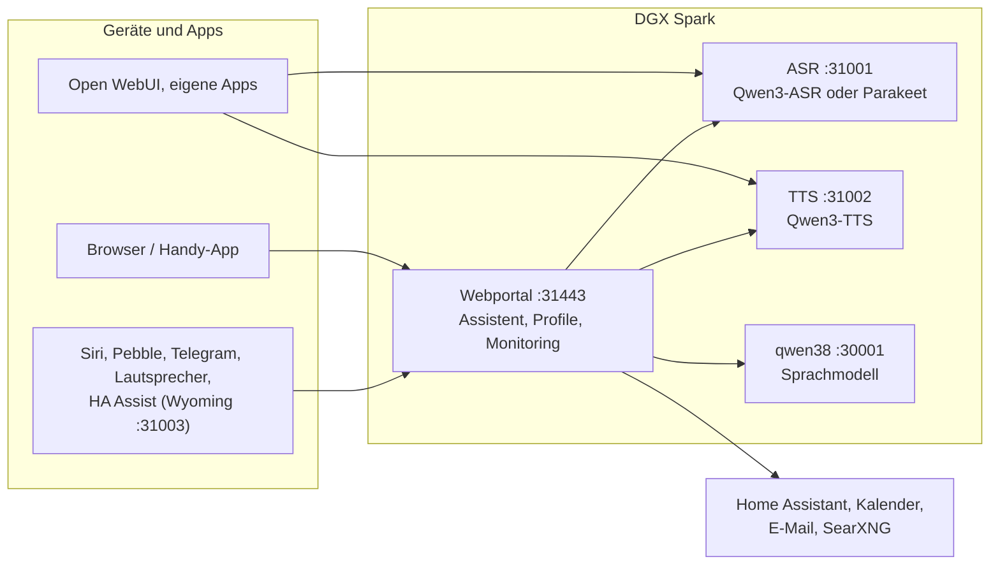

# Speech auf DGX Spark

[English](README.md) | **Deutsch** · Idee: Dominik Bornhäußer

Spracherkennung (**Qwen3-ASR**) und Sprachausgabe (**Qwen3-TTS**) als Dienste auf einer NVIDIA DGX Spark (GB10), dazu ein Webportal mit Sprach-Assistent, Profilen und Monitoring. Läuft nativ mit systemd, ohne Docker, neben [dgx-spark-qwen38](https://github.com/hasso5703/dgx-spark-qwen38), das das Sprachmodell liefert.

## Installation

```bash
git clone https://github.com/db9979/speech-on-dgx-spark
cd speech-on-dgx-spark
sudo ./install.sh
```

Das Skript fragt, was installiert werden soll:

- **Komplett**: Modelle, APIs und das Webportal mit dem Assistenten.
- **Nur die Modelle mit ihren APIs**: für Open WebUI, eigene Apps oder Home Assistant, ohne Portal. Verwaltet wird dann mit `sudo speech-spark`.

Am Ende stehen Adresse, Passwort und API-Schlüssel auf dem Bildschirm, danach spricht die Sprachausgabe einen Satz und die Spracherkennung prüft ihn. Das Portal liegt auf `https://SPARK:31443` (https ist nötig, damit der Browser das Mikrofon freigibt).

| Aufgabe | Befehl |
|---|---|
| Aktualisieren | Knopf im Portal unter *Einstellungen → Update und Sicherung* oder `sudo speech-spark update` |
| Adressen und Schlüssel anzeigen | `sudo speech-spark info` |
| Deinstallieren | `sudo ./uninstall.sh` (Konfiguration, Modelle und Stimmen bleiben; `--purge` löscht alles) |

Alle Optionen ohne Rückfragen (`--mode api --asr 1.7b --tts 0.6b --yes` …) stehen in [Installation im Detail](docs/de/installation.md).

## Letzte Änderungen

<!-- New version: add one line at the top here and in CHANGELOG.md, drop the oldest line here (keep 10). Details go to docs/de and docs/en, not into this README. -->

- **V01.0.295** Passkeys statt Code (Face ID, Touch ID, Windows Hello): unter Sicherheit anlegen (mit frischem Code), dann bei Anmeldung, Admin-Modus und wichtigen Änderungen „Mit Passkey“; nur über die Adresse mit Namen, App-Code bleibt als Rückfall, python-fido2 fest mit Hash
- **V01.0.294** Gesicht zeigt, was es tut (Einstellungen → Vorgaben, Admin, aus): Roboter und Comic zeigen beim Arbeiten ein kleines Zeichen (Lupe beim Suchen, Kalenderblatt, Brief, Glühbirne bei Home Assistant, Notizblock beim Merken, Denkblasen), zwinkern nach Erledigtem, schauen bei Fehlern ratlos und schlafen nach 5 Minuten Ruhe ein; nur aus den eigenen Chat-Ereignissen des Panels
- **V01.0.293** Mein Zustand springt nicht mehr nach oben: die 10-Sekunden-Aktualisierung ersetzt nur noch die Karte (Scrollposition und offene Verläufe bleiben), statt die ganze Seite neu zu bauen
- **V01.0.292** Sprachmodell: Auswahlliste der Modelle, die der eingestellte Server meldet (Einstellungen → Sprachmodell → Modell, „Automatisch“ = das erste, „Anderes eingeben …“ für freie Eingabe, „Neu laden“); nur Admin, Anfrage nur an die eingestellte Adresse, 5 s, 256 KB, 60 s Cache
- **V01.0.291** reMarkable „Ablegen in“ (Ich → reMarkable): eigener Zielordner für neue Dokumente wählbar, Standard „Spark“; der Spark legt nur neue Dokumente an, fehlt der Ordner später, nimmt er wieder „Spark“ und sagt es
- **V01.0.290** reMarkable senden: Fehler sagen jetzt, welche Datei die Cloud abgelehnt hat und was sie antwortet (ohne Token, auch im Journal „remarkable: sending failed“), jede 2xx-Antwort zählt, und eine nicht verstandene Zeile im Wurzelverzeichnis stoppt das Schreiben, bevor etwas verschwinden könnte
- **V01.0.289** Seltener Code eingeben: vertraute Browser 60 Tage (einstellbar 7–90, nach 30 Tagen ohne Nutzung wieder Code) mit Liste zum einzelnen Entfernen und Push-Meldung, ein richtiger Code gilt 10 Minuten in derselben Anmeldung (Balken mit „Beenden“; Passwort, zweiter Schritt, Rollen, Sicherungen, Codewort und Admin-Modus fragen immer), Admin-Modus im vertrauten Browser 60 statt 15 Minuten; Kalender, Mail und Home Assistant fragen den Code jetzt richtig ab statt „code required“
- **V01.0.288** Selbsttest „rmscene senkt packaging nicht“ passt zum Hash-Lock (Ersatzzeile eingerückt, Lock mit --no-deps und packaging ≥ 24 geprüft); main wieder grün
- **V01.0.287** Vorrang für Personen: Warteschlange von TTS/ASR gibt beim Abbruch eines Wartenden seinen Platz zuverlässig frei (auch unter Python 3.11)
- **V01.0.286** Bedienung Stufen 4, 5 und 7: Ich → Heute mit „Probier mal“, Antwort erklärt abgeschaltete Funktionen, Zustand als Karten, strenge CSP ohne Inline-Code, Rückgängig im Admin-Protokoll, verschlüsselte Sicherung nach außen (WebDAV, aus), Paketversionen mit Hashes, iPhone „Heute“

Alle Versionen: [CHANGELOG.md](CHANGELOG.md)

## So funktioniert es



1. Du sprichst ins Handy oder in den Browser. Das Portal schickt den Ton an die **Spracherkennung**, die Text daraus macht.
2. Das Portal gibt den Text mit Gedächtnis, Gesprächsverlauf und den erlaubten Werkzeugen an das **Sprachmodell** von qwen38.
3. Braucht die Antwort Kalender, Mail, Wetter, Websuche oder Home Assistant, holt das Portal die Daten selbst; schalten und eintragen geht nur nach Bestätigung.
4. Die Antwort geht Satz für Satz an die **Sprachausgabe** und wird gestreamt abgespielt, während das Modell noch schreibt.
5. Andere Apps können ASR und TTS auch direkt über die OpenAI-ähnlichen APIs nutzen, mit API-Schlüssel.

Jede Funktion ist pro Profil einzeln schaltbar und ab Werk aus. Updates laufen erst nach grünem Selbsttest und lassen sich zurücknehmen.

## Weiterlesen

- [Installation im Detail](docs/de/installation.md): Installationsarten, Befehl `speech-spark`, alle Optionen, Update, Deinstallieren
- [Assistent und Oberfläche](docs/de/assistent.md): Sprach-Chat, Handy, Funktionen, Menü
- [APIs und Einbinden](docs/de/apis-und-einbinden.md): Transkription, Sprachausgabe, Streaming, Open WebUI, Siri, Pebble
- [Sicherheit und Betrieb](docs/de/sicherheit-und-betrieb.md): Anmeldung, Sperren, Sicherungen, Wächter, Selbsttest, Logs
- [Technik und Fehlersuche](docs/de/technik.md): Dienste und Ports, Leistung messen, neben qwen38, Fehlersuche

Im Portal steht zu jeder Funktion eine eigene Anleitung unter *Einbinden → Anleitungen*.

## Lizenz

MIT, siehe [LICENSE](LICENSE). Die Modelle (Qwen3-ASR, Qwen3-TTS) und Pakete (vLLM, vllm-omni, PyTorch) werden bei der Installation geladen und stehen unter ihren eigenen Lizenzen. Dieses Projekt steht in keiner Verbindung zu NVIDIA oder dem Qwen-Team.
