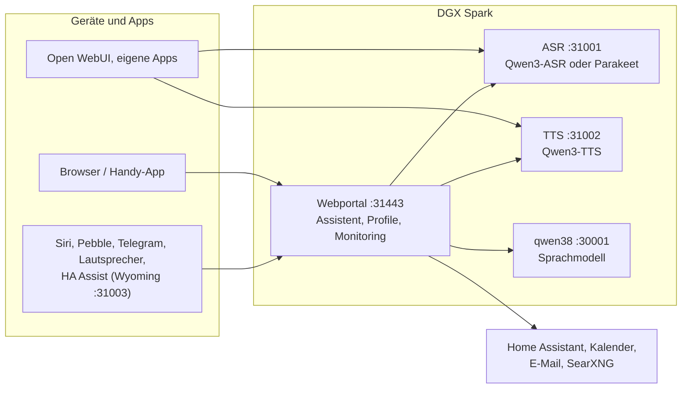

# Speech auf DGX Spark

[English](README.md) | **Deutsch** · Idee: Dominik Bornhäußer

Spracherkennung (**Qwen3-ASR**) und Sprachausgabe (**Qwen3-TTS**) als Dienste auf einer NVIDIA DGX Spark (GB10), dazu ein Webportal mit Sprach-Assistent, Profilen und Monitoring. Läuft nativ mit systemd, ohne Docker, neben [dgx-spark-qwen38](https://github.com/hasso5703/dgx-spark-qwen38), das das Sprachmodell liefert.

## Installation

```bash
git clone https://github.com/db9979/speech-on-dgx-spark
cd speech-on-dgx-spark
sudo ./install.sh
```

Das Skript fragt, was installiert werden soll:

- **Komplett**: Modelle, APIs und das Webportal mit dem Assistenten.
- **Nur die Modelle mit ihren APIs**: für Open WebUI, eigene Apps oder Home Assistant, ohne Portal. Verwaltet wird dann mit `sudo speech-spark`.

Am Ende stehen Adresse, Passwort und API-Schlüssel auf dem Bildschirm, danach spricht die Sprachausgabe einen Satz und die Spracherkennung prüft ihn. Das Portal liegt auf `https://SPARK:31443` (https ist nötig, damit der Browser das Mikrofon freigibt).

| Aufgabe | Befehl |
|---|---|
| Aktualisieren | Knopf im Portal unter *Einstellungen → Update und Sicherung* oder `sudo speech-spark update` |
| Adressen und Schlüssel anzeigen | `sudo speech-spark info` |
| Deinstallieren | `sudo ./uninstall.sh` (Konfiguration, Modelle und Stimmen bleiben; `--purge` löscht alles) |

Alle Optionen ohne Rückfragen (`--mode api --asr 1.7b --tts 0.6b --yes` …) stehen in [Installation im Detail](docs/de/installation.md).

## Letzte Änderungen

<!-- New version: add one line at the top here and in CHANGELOG.md, drop the oldest line here (keep 10). Details go to docs/de and docs/en, not into this README. -->

- **V01.0.218** Schnellere Antwort: Schalter „Schneller Antwortbeginn“ (Sprachmodell, aus) gibt die Uhrzeit mit der Frage statt an den Anfang der Anweisung, damit das Sprachmodell den Rest aus seinem Zwischenspeicher nimmt; die Diagnose „Gespräch“ zeigt pro Antwort, wo die Zeit hingeht (Vorbereitung, gelesene Tokens, erstes Wort, Denktext, Werkzeuge, erster Ton)
- **V01.0.217** Logs: Die Bereiche (Gespräch, Telegram, Raum …) zählen wieder; neuere journalctl-Versionen schreiben die Zeitzone als „+02:00“, das erkannte das Panel nicht, deshalb standen alle Rubriken auf 0
- **V01.0.216** Logs: Update-Zeilen mit Versionstext („Available“, „Update finished“) werden nicht mehr rot, nur weil im Text „Fehler“ steht
- **V01.0.215** Logs: Die eigenen Abrufe der Logs-Seite zählen nicht mehr als Fehler („f=errors“ in der Adresse) und stehen nicht mehr im Journal; bei Webanfragen entscheidet nur der Statuscode
- **V01.0.214** Telegram-Konflikt behoben: Das Panel startete seine Hintergrundaufgaben (Telegram-Abruf, Erinnerungen, Wächter …) doppelt, weil der https-Server sie noch einmal ausführte; jetzt einmal. Meldet Telegram trotzdem einen Konflikt, wartet der Spark immer länger, schreibt selten ins Log und zeigt unter Zustand einen Hinweis; Wetterdienst-Ausfall (503) wird still wiederholt
- **V01.0.213** Raum-Modus aus der Ferne: „Raummodus im Wohnzimmer an“ im Panel, in der App oder an einem anderen Lautsprecher startet einen eigenen, verbundenen Lautsprecher nach „Ja“ (feste Regel, kein Home Assistant, kein Codewort), „… aus“ beendet; Admin- und Profil-Schalter, aus
- **V01.0.212** Logs „Überblick zuerst“: Zustand → Logs mit Kacheln (Fehler, Bereiche mit Verlauf), letztem Fehler samt Hinweis, Filterknöpfen mit Zahlen, aufgeräumter Liste (Uhrzeit, Bereich, rot/gelb, ×n, Pausen), Suche, Live und „Kopieren für Thread“; unter Erweitert ausführliche Diagnose pro Bereich, schaltet sich selbst ab
- **V01.0.211** Update → „Jetzt prüfen“ zeigt, dass gerade geprüft wird („Prüfe …“), und danach die Uhrzeit der Prüfung
- **V01.0.210** Nur Text statt Sprache wird erklärt: hält der Browser den Ton zurück, sagt der Assistent „Einmal tippen“ und spricht danach; fällt die Sprachausgabe aus, steht der Grund als „chat: tts …“ im Diagnose-Log
- **V01.0.209** Raum-Modus in der iPhone-App: Zeile „… hört zu bis …“ mit Beenden oben im Chat, Live-Aktivität mit Restzeit, Widget „Raum-Modus“, Siri „Raummodus beenden mit Spark“ (nur beenden, nie starten)

Alle Versionen: [CHANGELOG.md](CHANGELOG.md)

## So funktioniert es



1. Du sprichst ins Handy oder in den Browser. Das Portal schickt den Ton an die **Spracherkennung**, die Text daraus macht.
2. Das Portal gibt den Text mit Gedächtnis, Gesprächsverlauf und den erlaubten Werkzeugen an das **Sprachmodell** von qwen38.
3. Braucht die Antwort Kalender, Mail, Wetter, Websuche oder Home Assistant, holt das Portal die Daten selbst; schalten und eintragen geht nur nach Bestätigung.
4. Die Antwort geht Satz für Satz an die **Sprachausgabe** und wird gestreamt abgespielt, während das Modell noch schreibt.
5. Andere Apps können ASR und TTS auch direkt über die OpenAI-ähnlichen APIs nutzen, mit API-Schlüssel.

Jede Funktion ist pro Profil einzeln schaltbar und ab Werk aus. Updates laufen erst nach grünem Selbsttest und lassen sich zurücknehmen.

## Weiterlesen

- [Installation im Detail](docs/de/installation.md): Installationsarten, Befehl `speech-spark`, alle Optionen, Update, Deinstallieren
- [Assistent und Oberfläche](docs/de/assistent.md): Sprach-Chat, Handy, Funktionen, Menü
- [APIs und Einbinden](docs/de/apis-und-einbinden.md): Transkription, Sprachausgabe, Streaming, Open WebUI, Siri, Pebble
- [Sicherheit und Betrieb](docs/de/sicherheit-und-betrieb.md): Anmeldung, Sperren, Sicherungen, Wächter, Selbsttest, Logs
- [Technik und Fehlersuche](docs/de/technik.md): Dienste und Ports, Leistung messen, neben qwen38, Fehlersuche

Im Portal steht zu jeder Funktion eine eigene Anleitung unter *Einbinden → Anleitungen*.

## Lizenz

MIT, siehe [LICENSE](LICENSE). Die Modelle (Qwen3-ASR, Qwen3-TTS) und Pakete (vLLM, vllm-omni, PyTorch) werden bei der Installation geladen und stehen unter ihren eigenen Lizenzen. Dieses Projekt steht in keiner Verbindung zu NVIDIA oder dem Qwen-Team.
