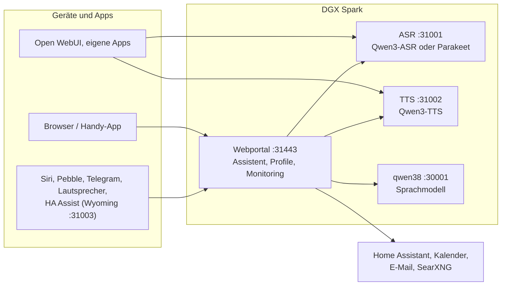

# Speech auf DGX Spark

[English](README.md) | **Deutsch** · Idee: Dominik Bornhäußer

[](https://buymeacoffee.com/zquu1xu570)

Spracherkennung (**Qwen3-ASR**) und Sprachausgabe (**Qwen3-TTS**) als Dienste auf einer NVIDIA DGX Spark (GB10), dazu ein Webportal mit Sprach-Assistent, Profilen und Monitoring. Läuft nativ mit systemd, ohne Docker, neben [dgx-spark-qwen38](https://github.com/hasso5703/dgx-spark-qwen38), das das Sprachmodell liefert.

## Installation

```bash
git clone https://github.com/db9979/speech-on-dgx-spark
cd speech-on-dgx-spark
sudo ./install.sh
```

Das Skript fragt, was installiert werden soll:

- **Komplett**: Modelle, APIs und das Webportal mit dem Assistenten.
- **Nur die Modelle mit ihren APIs**: für Open WebUI, eigene Apps oder Home Assistant, ohne Portal. Verwaltet wird dann mit `sudo speech-spark`.

Am Ende stehen Adresse, Passwort und API-Schlüssel auf dem Bildschirm, danach spricht die Sprachausgabe einen Satz und die Spracherkennung prüft ihn. Das Portal liegt auf `https://SPARK:31443` (https ist nötig, damit der Browser das Mikrofon freigibt).

| Aufgabe | Befehl |
|---|---|
| Aktualisieren | Knopf im Portal unter *Einstellungen → Update und Sicherung* oder `sudo speech-spark update` |
| Adressen und Schlüssel anzeigen | `sudo speech-spark info` |
| Deinstallieren | `sudo ./uninstall.sh` (Konfiguration, Modelle und Stimmen bleiben; `--purge` löscht alles) |

Alle Optionen ohne Rückfragen (`--mode api --asr 1.7b --tts 0.6b --yes` …) stehen in [Installation im Detail](docs/de/installation.md).

## Letzte Änderungen

<!-- New version: add one line at the top here and in CHANGELOG.md, drop the oldest line here (keep 10). Details go to docs/de and docs/en, not into this README. -->

- **V01.0.307** Vorab holen bei Rückfrage (aus): Fragt der Assistent zurück, holt das Panel schon Kalender, Mails, Wetter oder Pakete, während die Frage gesprochen wird; die Modell-Zuordnung unklarer Fragen läuft neben der Vorbereitung
- **V01.0.306** Selbsttest „Handy wie die App“ wartet unter der strengen CSP per Abfrage statt mit wait_for_function (war auf GitHub mal rot)
- **V01.0.305** Selbsttest Funktionen-Seite: Höhengrenze um die neue Zeile „Eindeutiges direkt abrufen“ erhöht (Tests auf GitHub waren nach V01.0.304 rot, das Update wartete)
- **V01.0.304** Antwort beginnt früher: „Schneller Antwortbeginn“ hält jetzt Anweisung, Werkzeugliste und Verlaufsbeginn gleich (alles Wechselnde geht mit der Frage), „Eindeutiges direkt abrufen“ (aus) holt Mails, Erinnerungen, Wetter und Pakete bei kurzen Fragen selbst, Logs → Anfragen zeigt pro Runde Anweisung, Werkzeuge und Gespräch in Zeichen
- **V01.0.303** Spark als MCP-Server (Funktionen → Spark als MCP-Server, Profil Ich → Dienste per MCP, alles aus): Open WebUI, n8n, Claude & Co. nutzen Sprache (transcribe, speak), Nachschlagen (Wikipedia, Archiv, Dokumente, Kalender, Erinnerungen, Heute) und ask_spark; pro Programm eigener Zugang mit eigenen Werkzeugen, „lokal“ nur im Heimnetz oder „extern“ per OAuth mit Warnhinweis und zweitem Anmeldeschritt; Handeln (Licht, Termine, Erinnerungen) nur als Vorschlag mit Ja im Panel; nie Mail, Gedächtnis, Verlauf, Geheimnisse oder Einstellungen
- **V01.0.302** Handy: Die Knöpfe unter dem Gesicht (Gespräch einstellen, Verlauf, Bild, Nachricht) brechen in Zeilen um statt links und rechts abgeschnitten zu werden; neuer Browsertest prüft auf 320 und 390 px in App-Ansicht und Rechner-Layout jede Seite, Einstellungsseite und Ich-Seite, dass nichts über den Rand ragt
- **V01.0.301** Selbsttest „Handy wie die App“ wartet, bis der Schritt in der Browser-Historie steht, bevor er zurückgeht (lief auf GitHub einmal aus der Seite heraus)
- **V01.0.300** Android-App „Spark“ als APK ohne Store (Funktionen → Android-App, aus; Ich → Android-App): Hülle um die Spark-Seite mit Mitteilungen bei geschlossener App (fragt alle 15 Minuten selbst nach, kein Google), Assistenten-Taste, Teilen an Spark und Hinweis auf neue Versionen; GitHub baut und signiert sie als android-v…, der Spark holt sie mit SHA-256-Prüfung und gibt sie per Download-Link mit Einmal-Token (QR, 30 Minuten) aus (docs/de/android-app.md)
- **V01.0.299** reMarkable „Neueste zuerst“ (Admin-Unterschalter + Ich → reMarkable, aus): Änderungszeit pro Seite, bei ähnlich guten Treffern rückt die neuere Notiz bis zu zwei Plätze vor (auch für „Erst lokal“), Treffer mit „geändert am“, „Was habe ich zuletzt/heute/gestern/diese Woche notiert?“ als feste Regel; neue Notizen kommen schneller: alle 3 Minuten ein kurzer Blick aufs Konto, bei Änderung sofort abgleichen
- **V01.0.298** Buy me a coffee: Link in der README und auf GitHub (Sponsor-Knopf), wie bei U-Jagd; an der App ändert sich nichts

Alle Versionen: [CHANGELOG.md](CHANGELOG.md)

## So funktioniert es



1. Du sprichst ins Handy oder in den Browser. Das Portal schickt den Ton an die **Spracherkennung**, die Text daraus macht.
2. Das Portal gibt den Text mit Gedächtnis, Gesprächsverlauf und den erlaubten Werkzeugen an das **Sprachmodell** von qwen38.
3. Braucht die Antwort Kalender, Mail, Wetter, Websuche oder Home Assistant, holt das Portal die Daten selbst; schalten und eintragen geht nur nach Bestätigung.
4. Die Antwort geht Satz für Satz an die **Sprachausgabe** und wird gestreamt abgespielt, während das Modell noch schreibt.
5. Andere Apps können ASR und TTS auch direkt über die OpenAI-ähnlichen APIs nutzen, mit API-Schlüssel.

Jede Funktion ist pro Profil einzeln schaltbar und ab Werk aus. Updates laufen erst nach grünem Selbsttest und lassen sich zurücknehmen.

## Weiterlesen

- [Installation im Detail](docs/de/installation.md): Installationsarten, Befehl `speech-spark`, alle Optionen, Update, Deinstallieren
- [Assistent und Oberfläche](docs/de/assistent.md): Sprach-Chat, Handy, Funktionen, Menü
- [APIs und Einbinden](docs/de/apis-und-einbinden.md): Transkription, Sprachausgabe, Streaming, Open WebUI, Siri, Pebble
- [Sicherheit und Betrieb](docs/de/sicherheit-und-betrieb.md): Anmeldung, Sperren, Sicherungen, Wächter, Selbsttest, Logs
- [Technik und Fehlersuche](docs/de/technik.md): Dienste und Ports, Leistung messen, neben qwen38, Fehlersuche

Im Portal steht zu jeder Funktion eine eigene Anleitung unter *Einbinden → Anleitungen*.

## Unterstützen

Das Projekt ist kostenlos. Wenn es dir gefällt, kannst du es über [buymeacoffee.com/zquu1xu570](https://buymeacoffee.com/zquu1xu570) unterstützen.

## Lizenz

MIT, siehe [LICENSE](LICENSE). Die Modelle (Qwen3-ASR, Qwen3-TTS) und Pakete (vLLM, vllm-omni, PyTorch) werden bei der Installation geladen und stehen unter ihren eigenen Lizenzen. Dieses Projekt steht in keiner Verbindung zu NVIDIA oder dem Qwen-Team.
