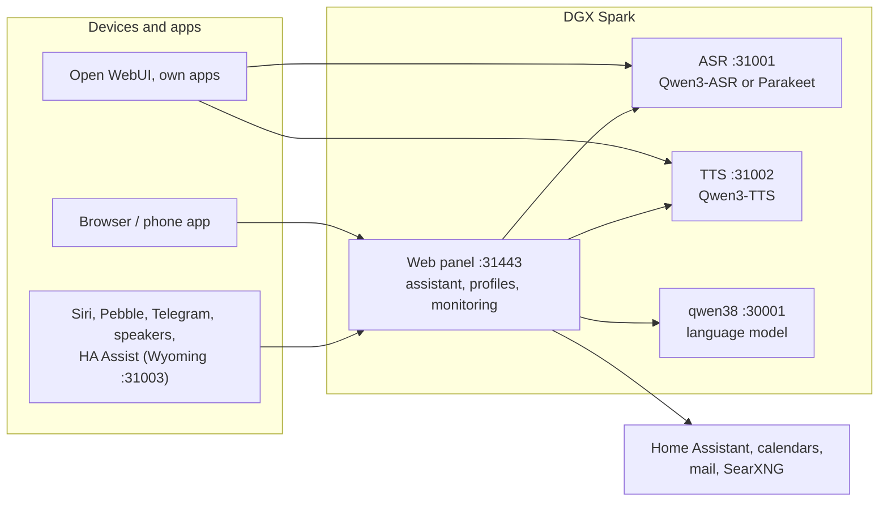

# Speech on DGX Spark

**English** | [Deutsch](README.de.md) · Idea: Dominik Bornhäußer

Speech recognition (**Qwen3-ASR**) and text to speech (**Qwen3-TTS**) as services on an NVIDIA DGX Spark (GB10), plus a web panel with a voice assistant, profiles and monitoring. Runs natively with systemd, without Docker, next to [dgx-spark-qwen38](https://github.com/hasso5703/dgx-spark-qwen38), which provides the language model.

## Installation

```bash
git clone https://github.com/db9979/speech-on-dgx-spark
cd speech-on-dgx-spark
sudo ./install.sh
```

The script asks what to install:

- **Complete**: models, APIs and the web panel with the assistant.
- **Only the models with their APIs**: for Open WebUI, your own apps or Home Assistant, without the panel. Managed with `sudo speech-spark`.

At the end it prints the address, password and API key, then TTS speaks a sentence and ASR checks it. The panel is at `https://SPARK:31443` (https is needed so the browser allows the microphone).

| Task | Command |
|---|---|
| Update | button in the panel under *Settings → Update and backup*, or `sudo speech-spark update` |
| Show addresses and keys | `sudo speech-spark info` |
| Uninstall | `sudo ./uninstall.sh` (config, models and voices stay; `--purge` removes everything) |

All options for running without questions (`--mode api --asr 1.7b --tts 0.6b --yes` …) are in [Installation in detail](docs/en/installation.md).

## Latest changes

<!-- New version: add one line at the top here and in CHANGELOG.md, drop the oldest line here (keep 10). Details go to docs/de and docs/en, not into this README. -->

- **V01.0.287** Priority for people: the TTS/ASR queue reliably frees the place of a waiting request that gives up (Python 3.11 too)
- **V01.0.286** UI stages 4, 5 and 7: Me → Today with "Try saying", answers explain switched-off functions, status as cards, strict CSP without inline code, undo in the admin log, encrypted offsite backup (WebDAV, off), package versions with hashes, iPhone "Today"
- **V01.0.285** Spark verwalten: the header button (and "Admin-Anmeldung" in the phone menu) only for profiles with an admin role, not for guests and ordinary profiles; panel-password login via the address with #admin at the end
- **V01.0.284** Priority for people, part 2: while an answer with priority has no first sentence yet, others' new requests to the language model wait at most 2 s (0–5 adjustable, running ones never stopped); the browser and the iPhone app report the start of a recording, background work then stops at once; Logs → Requests shows the wait
- **V01.0.283** New people: accepted invitations disappear 7 days after acceptance or at once with the deleted profile (its PIN links too); leftovers of profiles already deleted are removed when the list opens
- **V01.0.282** Priority for people (Features → Conversation, off; stage per profile only by the admin under People and devices, at most 3): sentences and recordings with priority overtake others' waiting ones in speech output and recognition (running ones never stopped, nobody starves), only the panel may say the stage; Logs → Requests shows the wait, Status → Check measures "two people at once"
- **V01.0.281** My status (Features → Everyday, off; Me → My status): what the Spark does for you in the background (reading documents, meaning search, document cards, reMarkable, inbox tidying, contacts, jobs, morning briefing, memory) with the reason it waits, last/next time and a 7-day history, plus connected services with their last answer; a red dot at "Me" when something needs you; names and numbers only; the iPhone app reads the same source, the admin sees counts only
- **V01.0.280** "Los geht's": saving the setup state no longer reloads the page (switch check skipped); the browser test logs a diagnosis instead of hanging
- **V01.0.279** reMarkable: "… and put it on my reMarkable" stores the whole answer, also after a web search; a fixed rule on the person's own words decides, the panel sends it after the answer and says so (before, the switch cut the tool)
- **V01.0.278** Update log without the pip error "dependency conflicts": rmscene (reMarkable) is installed without its dependencies, packaging stays current (was downgraded to 23.2, breaking wheel); existing installs are repaired on update

All versions: [CHANGELOG.md](CHANGELOG.md)

## How it works



1. You speak into your phone or browser. The panel sends the audio to **speech recognition**, which turns it into text.
2. The panel passes the text, with memory, conversation history and the allowed tools, to the **language model** from qwen38.
3. When the answer needs calendars, mail, weather, web search or Home Assistant, the panel fetches the data itself; switching and adding entries only happen after you confirm.
4. The answer goes sentence by sentence to **text to speech** and is played as a stream while the model is still writing.
5. Other apps can use ASR and TTS directly through the OpenAI-style APIs, with an API key.

Every feature can be switched on per profile and is off by default. Updates only go live after a green self-test and can be rolled back.

## Read more

- [Installation in detail](docs/en/installation.md): install modes, the `speech-spark` command, all options, update, uninstall
- [Assistant and panel](docs/en/assistant.md): voice chat, phone, features, menu
- [APIs and integration](docs/en/apis-and-integration.md): transcription, speech, streaming, Open WebUI, Siri, Pebble
- [Security and operation](docs/en/security-and-operation.md): login, lockouts, backups, watchdog, self-test, logs
- [Technical details and troubleshooting](docs/en/technical.md): services and ports, benchmarks, next to qwen38, troubleshooting

The panel has its own guide for every feature under *Einbinden → Anleitungen* (Integrate → Guides).

## License

MIT, see [LICENSE](LICENSE). The models (Qwen3-ASR, Qwen3-TTS) and packages (vLLM, vllm-omni, PyTorch) are downloaded during installation and come under their own licenses. This project is not affiliated with NVIDIA or the Qwen team.
