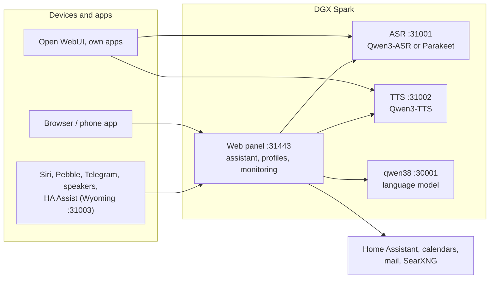

# Speech on DGX Spark

**English** | [Deutsch](README.de.md) · Idea: Dominik Bornhäußer

Speech recognition (**Qwen3-ASR**) and text to speech (**Qwen3-TTS**) as services on an NVIDIA DGX Spark (GB10), plus a web panel with a voice assistant, profiles and monitoring. Runs natively with systemd, without Docker, next to [dgx-spark-qwen38](https://github.com/hasso5703/dgx-spark-qwen38), which provides the language model.

## Installation

```bash
git clone https://github.com/db9979/speech-on-dgx-spark
cd speech-on-dgx-spark
sudo ./install.sh
```

The script asks what to install:

- **Complete**: models, APIs and the web panel with the assistant.
- **Only the models with their APIs**: for Open WebUI, your own apps or Home Assistant, without the panel. Managed with `sudo speech-spark`.

At the end it prints the address, password and API key, then TTS speaks a sentence and ASR checks it. The panel is at `https://SPARK:31443` (https is needed so the browser allows the microphone).

| Task | Command |
|---|---|
| Update | button in the panel under *Status → System and update*, or `sudo speech-spark update` |
| Show addresses and keys | `sudo speech-spark info` |
| Uninstall | `sudo ./uninstall.sh` (config, models and voices stay; `--purge` removes everything) |

All options for running without questions (`--mode api --asr 1.7b --tts 0.6b --yes` …) are in [Installation in detail](docs/en/installation.md).

## Latest changes

<!-- New version: add one line at the top here and in CHANGELOG.md, drop the oldest line here (keep 10). Details go to docs/de and docs/en, not into this README. -->

- **V01.0.204** Answers without blank lines at the start and end (left over from Qwen's think block), paragraphs stay
- **V01.0.203** Targeted tool choice in the panel: show the rules, try sentences, own words per group
- **V01.0.202** Targeted tool choice: fixed rules sort questions into a group, the model sees only matching tools (switch, off); real reason when locked
- **V01.0.201** iPhone app: envelope next to the input, "Ready?" view for messages, Siri "Message with Spark"
- **V01.0.200** Simpler messages: envelope button in the chat, "Schreib X, dass …" read by the panel itself, switch on with "Ja", ready view
- **V01.0.199** Browser test: a function switched on and a new version show without F5 (catches bugs like the one in .197)
- **V01.0.198** Fixed panel error from .197 (pages did not load, "reading 'json'")
- **V01.0.197** Functions switched on in the admin menu show right after saving (the page reloads itself), API answers are never cached; self-test against script/CSS links without a version
- **V01.0.196** Messages: asking to write works after a web/mail answer too, otherwise the assistant names the real reason
- **V01.0.195** iPhone app: messages to other profiles (list, write, reply right from the notification)

All versions: [CHANGELOG.md](CHANGELOG.md)

## How it works



1. You speak into your phone or browser. The panel sends the audio to **speech recognition**, which turns it into text.
2. The panel passes the text, with memory, conversation history and the allowed tools, to the **language model** from qwen38.
3. When the answer needs calendars, mail, weather, web search or Home Assistant, the panel fetches the data itself; switching and adding entries only happen after you confirm.
4. The answer goes sentence by sentence to **text to speech** and is played as a stream while the model is still writing.
5. Other apps can use ASR and TTS directly through the OpenAI-style APIs, with an API key.

Every feature can be switched on per profile and is off by default. Updates only go live after a green self-test and can be rolled back.

## Read more

- [Installation in detail](docs/en/installation.md): install modes, the `speech-spark` command, all options, update, uninstall
- [Assistant and panel](docs/en/assistant.md): voice chat, phone, features, menu
- [APIs and integration](docs/en/apis-and-integration.md): transcription, speech, streaming, Open WebUI, Siri, Pebble
- [Security and operation](docs/en/security-and-operation.md): login, lockouts, backups, watchdog, self-test, logs
- [Technical details and troubleshooting](docs/en/technical.md): services and ports, benchmarks, next to qwen38, troubleshooting

The panel has its own guide for every feature under *Einbinden → Anleitungen* (Integrate → Guides).

## License

MIT, see [LICENSE](LICENSE). The models (Qwen3-ASR, Qwen3-TTS) and packages (vLLM, vllm-omni, PyTorch) are downloaded during installation and come under their own licenses. This project is not affiliated with NVIDIA or the Qwen team.
