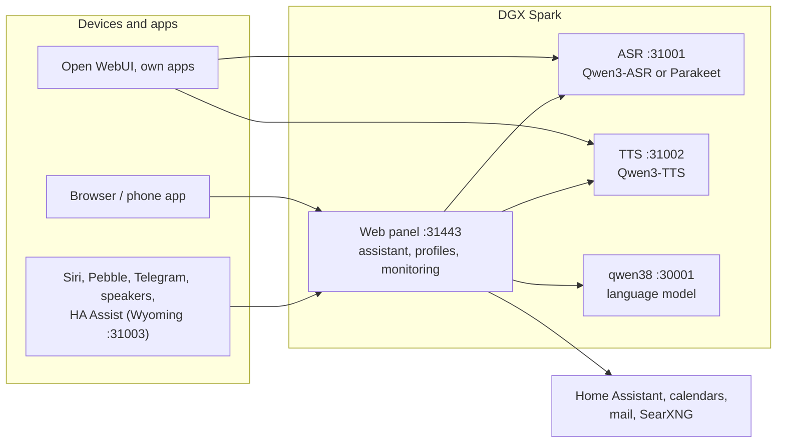

# Speech on DGX Spark

**English** | [Deutsch](README.de.md) · Idea: Dominik Bornhäußer

Speech recognition (**Qwen3-ASR**) and text to speech (**Qwen3-TTS**) as services on an NVIDIA DGX Spark (GB10), plus a web panel with a voice assistant, profiles and monitoring. Runs natively with systemd, without Docker, next to [dgx-spark-qwen38](https://github.com/hasso5703/dgx-spark-qwen38), which provides the language model.

## Installation

```bash
git clone https://github.com/db9979/speech-on-dgx-spark
cd speech-on-dgx-spark
sudo ./install.sh
```

The script asks what to install:

- **Complete**: models, APIs and the web panel with the assistant.
- **Only the models with their APIs**: for Open WebUI, your own apps or Home Assistant, without the panel. Managed with `sudo speech-spark`.

At the end it prints the address, password and API key, then TTS speaks a sentence and ASR checks it. The panel is at `https://SPARK:31443` (https is needed so the browser allows the microphone).

| Task | Command |
|---|---|
| Update | button in the panel under *Settings → Update and backup*, or `sudo speech-spark update` |
| Show addresses and keys | `sudo speech-spark info` |
| Uninstall | `sudo ./uninstall.sh` (config, models and voices stay; `--purge` removes everything) |

All options for running without questions (`--mode api --asr 1.7b --tts 0.6b --yes` …) are in [Installation in detail](docs/en/installation.md).

## Latest changes

<!-- New version: add one line at the top here and in CHANGELOG.md, drop the oldest line here (keep 10). Details go to docs/de and docs/en, not into this README. -->

- **V01.0.220** Answer starts sooner: targeted tool choice can show unclear questions only web search and memory (choice "only web search and memory", off), halving the request; a long first sentence goes to speech output at its comma from 50 characters on
- **V01.0.219** Stalls mid-sentence: the browser buffers longer afterwards (more after each further one), so it stalls once instead of stuttering; the log tells "before the piece" (pause between sentences) from "inside the piece" (real stall)
- **V01.0.218** Faster answers: switch "Schneller Antwortbeginn" (language model, off) sends the time with the question instead of at the start of the instructions, so the language model takes the rest from its cache; the "Gespräch" diagnosis shows per answer where the time goes (preparation, tokens read, first word, thinking text, tools, first sound)
- **V01.0.217** Logs: the areas (conversation, Telegram, room …) count again; newer journalctl writes the time zone as "+02:00", which the panel did not recognize, so every area showed 0
- **V01.0.216** Logs: update lines quoting a version text ("Available", "Update finished") no longer turn red just because the text says "Fehler"
- **V01.0.215** Logs: the log page's own requests no longer count as errors ("f=errors" in the address) and stay out of the journal; for web requests only the status code decides
- **V01.0.214** Telegram conflict fixed: the panel started its background tasks (Telegram polling, reminders, watchdog …) twice, because the https server ran them again; now once. If Telegram still reports a conflict, the Spark waits longer and longer, logs rarely and shows a hint under State; a weather service outage (503) is retried quietly
- **V01.0.213** Room mode from afar: “Raummodus im Wohnzimmer an” in the panel, the app or at another speaker starts an own connected speaker after “Ja” (fixed rule, no Home Assistant, no code word), “… aus” ends it; admin and profile switch, off
- **V01.0.212** Logs "overview first": State → Logs with tiles (errors, areas with history), the last error with a hint, filter buttons with counts, a tidy list (time, area, red/yellow, ×n, pauses), search, live and "Copy for thread"; under Advanced detailed diagnosis per area that switches itself off
- **V01.0.211** Update → "Check now" shows that it is checking ("Checking …") and afterwards the time of the check

All versions: [CHANGELOG.md](CHANGELOG.md)

## How it works



1. You speak into your phone or browser. The panel sends the audio to **speech recognition**, which turns it into text.
2. The panel passes the text, with memory, conversation history and the allowed tools, to the **language model** from qwen38.
3. When the answer needs calendars, mail, weather, web search or Home Assistant, the panel fetches the data itself; switching and adding entries only happen after you confirm.
4. The answer goes sentence by sentence to **text to speech** and is played as a stream while the model is still writing.
5. Other apps can use ASR and TTS directly through the OpenAI-style APIs, with an API key.

Every feature can be switched on per profile and is off by default. Updates only go live after a green self-test and can be rolled back.

## Read more

- [Installation in detail](docs/en/installation.md): install modes, the `speech-spark` command, all options, update, uninstall
- [Assistant and panel](docs/en/assistant.md): voice chat, phone, features, menu
- [APIs and integration](docs/en/apis-and-integration.md): transcription, speech, streaming, Open WebUI, Siri, Pebble
- [Security and operation](docs/en/security-and-operation.md): login, lockouts, backups, watchdog, self-test, logs
- [Technical details and troubleshooting](docs/en/technical.md): services and ports, benchmarks, next to qwen38, troubleshooting

The panel has its own guide for every feature under *Einbinden → Anleitungen* (Integrate → Guides).

## License

MIT, see [LICENSE](LICENSE). The models (Qwen3-ASR, Qwen3-TTS) and packages (vLLM, vllm-omni, PyTorch) are downloaded during installation and come under their own licenses. This project is not affiliated with NVIDIA or the Qwen team.
