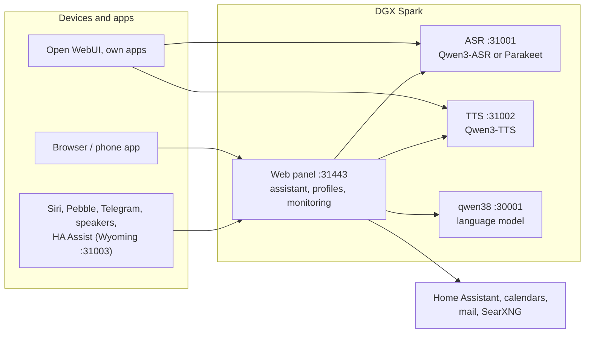

# Speech on DGX Spark

**English** | [Deutsch](README.de.md) · Idea: Dominik Bornhäußer

Speech recognition (**Qwen3-ASR**) and text to speech (**Qwen3-TTS**) as services on an NVIDIA DGX Spark (GB10), plus a web panel with a voice assistant, profiles and monitoring. Runs natively with systemd, without Docker, next to [dgx-spark-qwen38](https://github.com/hasso5703/dgx-spark-qwen38), which provides the language model.

## Installation

```bash
git clone https://github.com/db9979/speech-on-dgx-spark
cd speech-on-dgx-spark
sudo ./install.sh
```

The script asks what to install:

- **Complete**: models, APIs and the web panel with the assistant.
- **Only the models with their APIs**: for Open WebUI, your own apps or Home Assistant, without the panel. Managed with `sudo speech-spark`.

At the end it prints the address, password and API key, then TTS speaks a sentence and ASR checks it. The panel is at `https://SPARK:31443` (https is needed so the browser allows the microphone).

| Task | Command |
|---|---|
| Update | button in the panel under *Overview → System and update*, or `sudo speech-spark update` |
| Show addresses and keys | `sudo speech-spark info` |
| Uninstall | `sudo ./uninstall.sh` (config, models and voices stay; `--purge` removes everything) |

All options for running without questions (`--mode api --asr 1.7b --tts 0.6b --yes` …) are in [Installation in detail](docs/en/installation.md).

## Latest changes

<!-- New version: add one line at the top here and in CHANGELOG.md, drop the oldest line here (keep 10). Details go to docs/de and docs/en, not into this README. -->

- **V01.0.119** Quality test: newly broken questions show as a note on top of every admin page for a week
- **V01.0.118** Learning from corrections (off, admin + profile): after "Nein, …" the assistant asks "Soll ich mir merken …?" and stores it only after a yes; corrected questions can go into the quality test
- **V01.0.117** Required tools from one table, answer check holds back made-up times, dates, scores and amounts, temperature 0.1 when choosing tools, quality test with rewordings, a retry and a history, optional thinking while choosing tools
- **V01.0.116** Self-test during update fixed: a new test talked to the running TTS engine on the Spark (Event loop is closed)
- **V01.0.115** Security stage 6: self-test scanner refuses new code with shell=True/eval, routes without login, uploads without a limit, unescaped onclick values and unsorted assistant tools
- **V01.0.114** Security stage 5: admin logout ends every copy, log the admin out everywhere, code word message deleted in Telegram, tidying only on exact sender, forged parcel mails ignored, errors and service details not for guests
- **V01.0.113** Security stage 4: install and update never write as root through links, no passwords in the update log, qwen38 key only from a real file, rewritten history is refused, optionally only signed versions
- **V01.0.112** Questions about reminders, match results and news now always go through the tool instead of the model's own knowledge
- **V01.0.111** Security stage 3: lockout no longer locks out your own browsers, X-Forwarded-For only from the listed proxy, load limits for chat and speech recognition, outbound connections checked (home network only with a switch, answers max. 20 MB, credentials only to their site), API key required on the network
- **V01.0.110** Adding an appointment without the word “Termin” (e.g. “Trag Zahnarzt am Dienstag ein”) now always goes through the calendar proposal; quality test accepts “3 zu 1” as the score

All versions: [CHANGELOG.md](CHANGELOG.md)

## How it works



1. You speak into your phone or browser. The panel sends the audio to **speech recognition**, which turns it into text.
2. The panel passes the text, with memory, conversation history and the allowed tools, to the **language model** from qwen38.
3. When the answer needs calendars, mail, weather, web search or Home Assistant, the panel fetches the data itself; switching and adding entries only happen after you confirm.
4. The answer goes sentence by sentence to **text to speech** and is played as a stream while the model is still writing.
5. Other apps can use ASR and TTS directly through the OpenAI-style APIs, with an API key.

Every feature can be switched on per profile and is off by default. Updates only go live after a green self-test and can be rolled back.

## Read more

- [Installation in detail](docs/en/installation.md): install modes, the `speech-spark` command, all options, update, uninstall
- [Assistant and panel](docs/en/assistant.md): voice chat, phone, features, menu
- [APIs and integration](docs/en/apis-and-integration.md): transcription, speech, streaming, Open WebUI, Siri, Pebble
- [Security and operation](docs/en/security-and-operation.md): login, lockouts, backups, watchdog, self-test, logs
- [Technical details and troubleshooting](docs/en/technical.md): services and ports, benchmarks, next to qwen38, troubleshooting

The panel has its own guide for every feature under *Einbinden → Anleitungen* (Integrate → Guides).

## License

MIT, see [LICENSE](LICENSE). The models (Qwen3-ASR, Qwen3-TTS) and packages (vLLM, vllm-omni, PyTorch) are downloaded during installation and come under their own licenses. This project is not affiliated with NVIDIA or the Qwen team.
