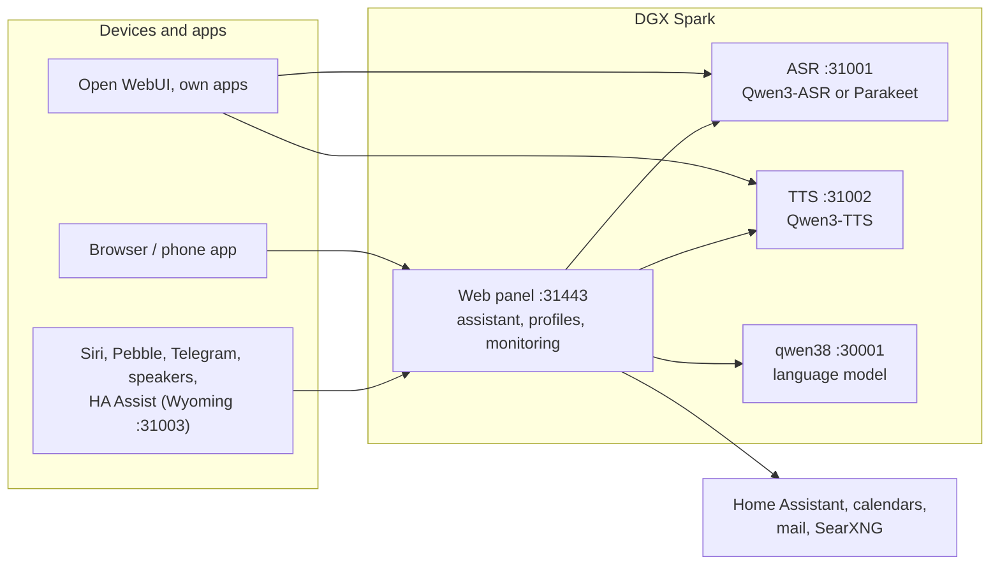

# Speech on DGX Spark

**English** | [Deutsch](README.de.md) · Idea: Dominik Bornhäußer

Speech recognition (**Qwen3-ASR**) and text to speech (**Qwen3-TTS**) as services on an NVIDIA DGX Spark (GB10), plus a web panel with a voice assistant, profiles and monitoring. Runs natively with systemd, without Docker, next to [dgx-spark-qwen38](https://github.com/hasso5703/dgx-spark-qwen38), which provides the language model.

## Installation

```bash
git clone https://github.com/db9979/speech-on-dgx-spark
cd speech-on-dgx-spark
sudo ./install.sh
```

The script asks what to install:

- **Complete**: models, APIs and the web panel with the assistant.
- **Only the models with their APIs**: for Open WebUI, your own apps or Home Assistant, without the panel. Managed with `sudo speech-spark`.

At the end it prints the address, password and API key, then TTS speaks a sentence and ASR checks it. The panel is at `https://SPARK:31443` (https is needed so the browser allows the microphone).

| Task | Command |
|---|---|
| Update | button in the panel under *Overview → System and update*, or `sudo speech-spark update` |
| Show addresses and keys | `sudo speech-spark info` |
| Uninstall | `sudo ./uninstall.sh` (config, models and voices stay; `--purge` removes everything) |

All options for running without questions (`--mode api --asr 1.7b --tts 0.6b --yes` …) are in [Installation in detail](docs/en/installation.md).

## Latest changes

<!-- New version: add one line at the top here and in CHANGELOG.md, drop the oldest line here (keep 10). Details go to docs/de and docs/en, not into this README. -->

- **V01.0.139** Room mode ignores TV voices: per device "Who it listens to" (everybody / known voices while the TV is on / always known voices only), with a trial that only counts; admin switch "Ignore TV voices", off by default
- **V01.0.138** Speakers: no more gaps in long answers, new firmware 2.5.1.5 waits when its sound buffer is full instead of dropping sound; the Spark keeps 0.7 s lead
- **V01.0.137** Speakers: sound no longer stutters, the Spark buffers ahead (0.6 s before start, up to 0.9 s lead, after a stall it collects 0.3 s again); stalls show under "Check" and in the log
- **V01.0.136** Speakers: "Check" shows live what the speaker is doing (every 2 seconds), also in room mode (only that a sentence was heard and whether it speaks, never the text)
- **V01.0.135** Speakers: volume and microphone sensitivity per speaker under Me → Speakers (applies at once when connected, otherwise at the next connection)
- **V01.0.134** Speakers: quiet microphones (boards with an audio chip such as the Waveshare board) now count as speech, quiet recordings are raised before speech recognition, and the microphone level is in the log
- **V01.0.133** Speakers: firmware for the Waveshare ESP32-S3-AUDIO-Board (ES8311 audio chip, two microphones), and updates follow the board type last written over USB
- **V01.0.132** Speakers without a display: crash right after joining the Wi-Fi fixed (the firmware tried to load font and emoji onto a screen that is not there), new firmware 2.5.1.3
- **V01.0.131** Checking a speaker: under Me → Speakers "Check" shows switches, address, recent events and microphone level, "Check network" tests address, certificate and WebSocket, "Test" plays a tone and a sentence and checks the microphone, and the board's own log can be read over USB in the browser
- **V01.0.130** Web search is never silently missing: right after an answer from mail a clear search question searches again, "such im Internet" or "google mal" always goes through the search, otherwise the assistant says why it does not search

All versions: [CHANGELOG.md](CHANGELOG.md)

## How it works



1. You speak into your phone or browser. The panel sends the audio to **speech recognition**, which turns it into text.
2. The panel passes the text, with memory, conversation history and the allowed tools, to the **language model** from qwen38.
3. When the answer needs calendars, mail, weather, web search or Home Assistant, the panel fetches the data itself; switching and adding entries only happen after you confirm.
4. The answer goes sentence by sentence to **text to speech** and is played as a stream while the model is still writing.
5. Other apps can use ASR and TTS directly through the OpenAI-style APIs, with an API key.

Every feature can be switched on per profile and is off by default. Updates only go live after a green self-test and can be rolled back.

## Read more

- [Installation in detail](docs/en/installation.md): install modes, the `speech-spark` command, all options, update, uninstall
- [Assistant and panel](docs/en/assistant.md): voice chat, phone, features, menu
- [APIs and integration](docs/en/apis-and-integration.md): transcription, speech, streaming, Open WebUI, Siri, Pebble
- [Security and operation](docs/en/security-and-operation.md): login, lockouts, backups, watchdog, self-test, logs
- [Technical details and troubleshooting](docs/en/technical.md): services and ports, benchmarks, next to qwen38, troubleshooting

The panel has its own guide for every feature under *Einbinden → Anleitungen* (Integrate → Guides).

## License

MIT, see [LICENSE](LICENSE). The models (Qwen3-ASR, Qwen3-TTS) and packages (vLLM, vllm-omni, PyTorch) are downloaded during installation and come under their own licenses. This project is not affiliated with NVIDIA or the Qwen team.
