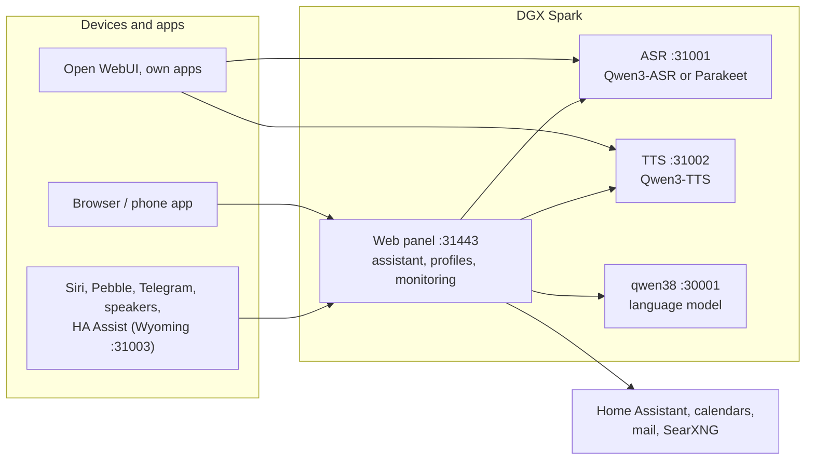

# Speech on DGX Spark

**English** | [Deutsch](README.de.md) · Idea: Dominik Bornhäußer

Speech recognition (**Qwen3-ASR**) and text to speech (**Qwen3-TTS**) as services on an NVIDIA DGX Spark (GB10), plus a web panel with a voice assistant, profiles and monitoring. Runs natively with systemd, without Docker, next to [dgx-spark-qwen38](https://github.com/hasso5703/dgx-spark-qwen38), which provides the language model.

## Installation

```bash
git clone https://github.com/db9979/speech-on-dgx-spark
cd speech-on-dgx-spark
sudo ./install.sh
```

The script asks what to install:

- **Complete**: models, APIs and the web panel with the assistant.
- **Only the models with their APIs**: for Open WebUI, your own apps or Home Assistant, without the panel. Managed with `sudo speech-spark`.

At the end it prints the address, password and API key, then TTS speaks a sentence and ASR checks it. The panel is at `https://SPARK:31443` (https is needed so the browser allows the microphone).

| Task | Command |
|---|---|
| Update | button in the panel under *Settings → Update and backup*, or `sudo speech-spark update` |
| Show addresses and keys | `sudo speech-spark info` |
| Uninstall | `sudo ./uninstall.sh` (config, models and voices stay; `--purge` removes everything) |

All options for running without questions (`--mode api --asr 1.7b --tts 0.6b --yes` …) are in [Installation in detail](docs/en/installation.md).

## Latest changes

<!-- New version: add one line at the top here and in CHANGELOG.md, drop the oldest line here (keep 10). Details go to docs/de and docs/en, not into this README. -->

- **V01.0.232** Ich → Dokumente shows each document's progress: "page 3 of 12 read" with a bar and the reason (reading page …, waits for a quiet minute, daily limit, switch off), then "meaning 40 of 120"; the list refreshes every 10 s while something runs; the iPhone app shows "page x of y read"
- **V01.0.231** "Check priority" measures the case with priority like a real conversation (recognition first, then speech output)
- **V01.0.230** Pebble watch more reliable and the face from the web: the watch retries failed messages, gives up after 30 s without an answer, reports its buffer continuously (a lost report no longer stops the sound), old answers are dropped; the phone sends text before audio, bigger audio pieces (3.8 KB), retries instead of losing silently; one time line per answer in the log (area "Watch"); new and off (admin + profile): "Pair the Pebble watch" with a setup code from Me → Pebble watch, own watch key only for /api/watch/; the watch shows the face picked in the panel (robot or comic)
- **V01.0.229** Updates on tars work again: a self-test from .225 looked for install.sh, which the update self-test does not have
- **V01.0.228** Status: card “Own documents” under Zustand → Monitoring shows whether the meaning model runs (with its memory), starts, waits for free memory or failed, how many pieces have a meaning and how many pages wait to be read (counts only, admin only, shown while a switch is on)
- **V01.0.227** iPhone app: look at "My documents" (PDFs and pictures in Apple's preview, otherwise the stored text)
- **V01.0.226** Another voice got the owner's mail at a speaker: personal things (mail, appointments, reminders, memory, documents, smart home …) at a speaker now only for the clearly recognized owner's voice, else guest rights with a short note (fixed rule, no switch); Logs → speakers shows each refused question in yellow with its reason
- **V01.0.225** Speech always comes first: background work waits while someone speaks, its running request to the language model is cancelled and repeated later; ASR and TTS get more CPU and disk share; Zustand → Prüfen → "Check priority" measures it (fixed rule, no switch)
- **V01.0.224** Knowledge from uploads: documents per profile in one SQLite file (old ones taken over, backups consistent), more file types (Excel, PowerPoint, OpenDocument, .eml), view documents (text, pictures and PDFs in the browser), on/off per document, "Try the search", clickable sources with page; new and each off (admin + profile): the language model reads pictures and scans in quiet moments (also "Picture to My documents" in the chat, /merken in Telegram), meaning search with a small CPU model in its own process, keep originals with a space limit; no web search after documents in the same answer
- **V01.0.223** Conversation goes on normally after answers from documents, web or mail: sometimes only the note "(Diese frühere Antwort beruhte auf Texten von außen …)" came instead of an answer; older such answers now leave the history with their question, the model uses the tool again when needed, and the note is never shown or spoken (locks stay)

All versions: [CHANGELOG.md](CHANGELOG.md)

## How it works



1. You speak into your phone or browser. The panel sends the audio to **speech recognition**, which turns it into text.
2. The panel passes the text, with memory, conversation history and the allowed tools, to the **language model** from qwen38.
3. When the answer needs calendars, mail, weather, web search or Home Assistant, the panel fetches the data itself; switching and adding entries only happen after you confirm.
4. The answer goes sentence by sentence to **text to speech** and is played as a stream while the model is still writing.
5. Other apps can use ASR and TTS directly through the OpenAI-style APIs, with an API key.

Every feature can be switched on per profile and is off by default. Updates only go live after a green self-test and can be rolled back.

## Read more

- [Installation in detail](docs/en/installation.md): install modes, the `speech-spark` command, all options, update, uninstall
- [Assistant and panel](docs/en/assistant.md): voice chat, phone, features, menu
- [APIs and integration](docs/en/apis-and-integration.md): transcription, speech, streaming, Open WebUI, Siri, Pebble
- [Security and operation](docs/en/security-and-operation.md): login, lockouts, backups, watchdog, self-test, logs
- [Technical details and troubleshooting](docs/en/technical.md): services and ports, benchmarks, next to qwen38, troubleshooting

The panel has its own guide for every feature under *Einbinden → Anleitungen* (Integrate → Guides).

## License

MIT, see [LICENSE](LICENSE). The models (Qwen3-ASR, Qwen3-TTS) and packages (vLLM, vllm-omni, PyTorch) are downloaded during installation and come under their own licenses. This project is not affiliated with NVIDIA or the Qwen team.
