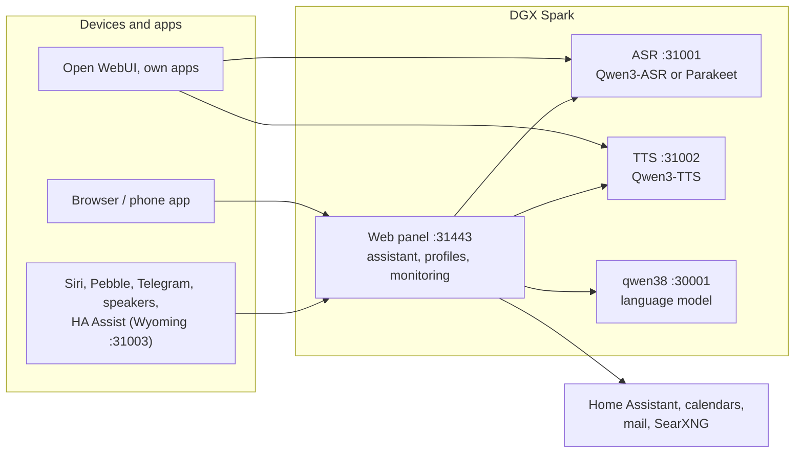

# Speech on DGX Spark

**English** | [Deutsch](README.de.md) · Idea: Dominik Bornhäußer

Speech recognition (**Qwen3-ASR**) and text to speech (**Qwen3-TTS**) as services on an NVIDIA DGX Spark (GB10), plus a web panel with a voice assistant, profiles and monitoring. Runs natively with systemd, without Docker, next to [dgx-spark-qwen38](https://github.com/hasso5703/dgx-spark-qwen38), which provides the language model.

## Installation

```bash
git clone https://github.com/db9979/speech-on-dgx-spark
cd speech-on-dgx-spark
sudo ./install.sh
```

The script asks what to install:

- **Complete**: models, APIs and the web panel with the assistant.
- **Only the models with their APIs**: for Open WebUI, your own apps or Home Assistant, without the panel. Managed with `sudo speech-spark`.

At the end it prints the address, password and API key, then TTS speaks a sentence and ASR checks it. The panel is at `https://SPARK:31443` (https is needed so the browser allows the microphone).

| Task | Command |
|---|---|
| Update | button in the panel under *Status → System and update*, or `sudo speech-spark update` |
| Show addresses and keys | `sudo speech-spark info` |
| Uninstall | `sudo ./uninstall.sh` (config, models and voices stay; `--purge` removes everything) |

All options for running without questions (`--mode api --asr 1.7b --tts 0.6b --yes` …) are in [Installation in detail](docs/en/installation.md).

## Latest changes

<!-- New version: add one line at the top here and in CHANGELOG.md, drop the oldest line here (keep 10). Details go to docs/de and docs/en, not into this README. -->

- **V01.0.163** Performance check rates every value (very good, good, tight, too slow, with one sentence why), an overall verdict on top, new "words understood" percentage and the comparison with the last run
- **V01.0.162** iPhone app: "My profile" with voice, answer length, by itself and morning briefing; the app's rights and the tone only shown (the Spark changes only a fixed list)
- **V01.0.161** iPhone app: quick start (Action button, Control Center, lock screen), history like the log, ask about a photo or document (the iPhone reads the text), store documents (off, profile switch), questions wait offline, English interface
- **V01.0.160** iPhone app has a new icon: a glowing spark on night blue with sound waves
- **V01.0.159** iPhone app: push with the app closed through Apple (off, admin key + profile; Apple only sees "new message", the app fetches the text from the Spark), CarPlay conversation (waits for Apple's grant), publishing guide
- **V01.0.158** Language model gone: a fixed sentence instead of silence (also speakers, watch, iPhone); time to the first sound under Status → Checks with a warning when clearly slower; the live check also tries tool choice and web search
- **V01.0.157** Updates only to versions whose GitHub tests passed (panel and update.sh; newer red or running changes only as a note; by hand: update.sh --newest)
- **V01.0.156** Chat code split up (no change in behaviour): rights and prompt in chat_turn.py, tools in chat_tools.py, answer and sound in chat.py
- **V01.0.155** iPhone app shows the face picked in the panel, now also the comic face with its own life (lids, glances, brows, mouth under the mustache)
- **V01.0.154** Selectable face: the admin picks "Robot" (as before) or "Comic" under Settings → Defaults (a caricature that looks around, blinks, moves its mouth with the voice and shows the state with a coloured ring); for the panel and the iPhone app

All versions: [CHANGELOG.md](CHANGELOG.md)

## How it works



1. You speak into your phone or browser. The panel sends the audio to **speech recognition**, which turns it into text.
2. The panel passes the text, with memory, conversation history and the allowed tools, to the **language model** from qwen38.
3. When the answer needs calendars, mail, weather, web search or Home Assistant, the panel fetches the data itself; switching and adding entries only happen after you confirm.
4. The answer goes sentence by sentence to **text to speech** and is played as a stream while the model is still writing.
5. Other apps can use ASR and TTS directly through the OpenAI-style APIs, with an API key.

Every feature can be switched on per profile and is off by default. Updates only go live after a green self-test and can be rolled back.

## Read more

- [Installation in detail](docs/en/installation.md): install modes, the `speech-spark` command, all options, update, uninstall
- [Assistant and panel](docs/en/assistant.md): voice chat, phone, features, menu
- [APIs and integration](docs/en/apis-and-integration.md): transcription, speech, streaming, Open WebUI, Siri, Pebble
- [Security and operation](docs/en/security-and-operation.md): login, lockouts, backups, watchdog, self-test, logs
- [Technical details and troubleshooting](docs/en/technical.md): services and ports, benchmarks, next to qwen38, troubleshooting

The panel has its own guide for every feature under *Einbinden → Anleitungen* (Integrate → Guides).

## License

MIT, see [LICENSE](LICENSE). The models (Qwen3-ASR, Qwen3-TTS) and packages (vLLM, vllm-omni, PyTorch) are downloaded during installation and come under their own licenses. This project is not affiliated with NVIDIA or the Qwen team.
