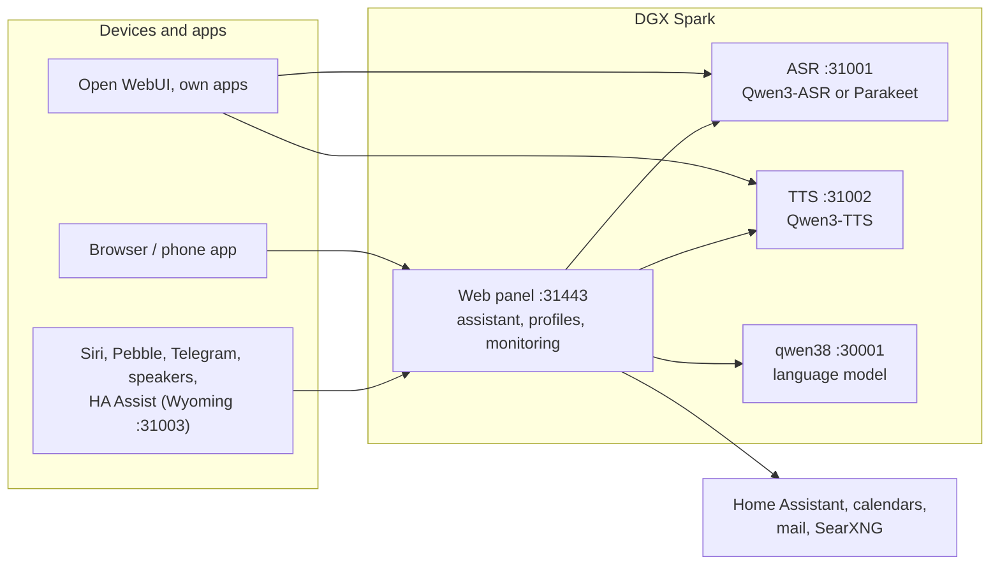

# Speech on DGX Spark

**English** | [Deutsch](README.de.md) · Idea: Dominik Bornhäußer

Speech recognition (**Qwen3-ASR**) and text to speech (**Qwen3-TTS**) as services on an NVIDIA DGX Spark (GB10), plus a web panel with a voice assistant, profiles and monitoring. Runs natively with systemd, without Docker, next to [dgx-spark-qwen38](https://github.com/hasso5703/dgx-spark-qwen38), which provides the language model.

## Installation

```bash
git clone https://github.com/db9979/speech-on-dgx-spark
cd speech-on-dgx-spark
sudo ./install.sh
```

The script asks what to install:

- **Complete**: models, APIs and the web panel with the assistant.
- **Only the models with their APIs**: for Open WebUI, your own apps or Home Assistant, without the panel. Managed with `sudo speech-spark`.

At the end it prints the address, password and API key, then TTS speaks a sentence and ASR checks it. The panel is at `https://SPARK:31443` (https is needed so the browser allows the microphone).

| Task | Command |
|---|---|
| Update | button in the panel under *Settings → Update and backup*, or `sudo speech-spark update` |
| Show addresses and keys | `sudo speech-spark info` |
| Uninstall | `sudo ./uninstall.sh` (config, models and voices stay; `--purge` removes everything) |

All options for running without questions (`--mode api --asr 1.7b --tts 0.6b --yes` …) are in [Installation in detail](docs/en/installation.md).

## Latest changes

<!-- New version: add one line at the top here and in CHANGELOG.md, drop the oldest line here (keep 10). Details go to docs/de and docs/en, not into this README. -->

- **V01.0.297** Code word at a speaker (off): if a speaker recognises your voice only narrowly or something is unusual, it asks for your own code word before personal things; never a foreign voice; after 3 wrong ones a 30-minute pause and a notification
- **V01.0.296** Phone looks like the iPhone app (always below 760 px, can be turned off under Appearance → "Show the computer layout"): tabs Spark · Today · Documents · Me · Manage by role, chat with face, big mic and an always visible text field, Today with the same cards as Me → Today, history as a sheet from below, iOS-style lists and switches, sub-pages slide in from the right, the Android and Safari back gesture goes one level back; same on iPhone and Android, no new endpoints
- **V01.0.295** Passkeys instead of the code (Face ID, Touch ID, Windows Hello): add one under Security (with a fresh code), then „With passkey“ at sign-in, for the admin mode and important changes; only over the address with a name, the app code stays as the way back, python-fido2 pinned with hash
- **V01.0.294** Face shows what it does (Settings → Defaults, admin, off): robot and comic show a small sign while working (magnifier for searches, calendar sheet, letter, light bulb for Home Assistant, note pad for memory, thought bubbles), wink after something was done, look puzzled on errors and fall asleep after 5 quiet minutes; only from the panel's own chat events
- **V01.0.293** My status no longer jumps to the top: the 10-second refresh replaces only the card (scroll position and open histories stay) instead of rebuilding the whole page
- **V01.0.292** Language model: a choice list of the models the configured server reports (Settings → Language model → Model, "Automatic" = the first, "Type another …" for free text, "Reload"); admin only, request only to the configured address, 5 s, 256 KB, 60 s cache
- **V01.0.291** reMarkable "Put into" (Me → reMarkable): choose an own folder for new documents, default "Spark"; the Spark only adds new documents, and if the folder is gone later it takes "Spark" again and says so
- **V01.0.290** reMarkable sending: errors now say which file the cloud refused and what it answered (no token, also in the journal "remarkable: sending failed"), any 2xx answer counts, and a root line the Spark does not understand stops the write before anything could vanish
- **V01.0.289** Fewer codes: trusted browsers for 60 days (7–90, a code again after 30 days without use) with a list to remove them one by one and a push note, a right code counts 10 minutes in the same login (bar with „End“; password, second step, roles, backups, code word and admin mode always ask), admin mode in a trusted browser 60 instead of 15 minutes; calendar, mail and Home Assistant now ask for the code instead of showing „code required“
- **V01.0.288** Self-test "rmscene does not downgrade packaging" fits the hash lock (fallback line indented, lock checked for --no-deps and packaging ≥ 24); main green again

All versions: [CHANGELOG.md](CHANGELOG.md)

## How it works



1. You speak into your phone or browser. The panel sends the audio to **speech recognition**, which turns it into text.
2. The panel passes the text, with memory, conversation history and the allowed tools, to the **language model** from qwen38.
3. When the answer needs calendars, mail, weather, web search or Home Assistant, the panel fetches the data itself; switching and adding entries only happen after you confirm.
4. The answer goes sentence by sentence to **text to speech** and is played as a stream while the model is still writing.
5. Other apps can use ASR and TTS directly through the OpenAI-style APIs, with an API key.

Every feature can be switched on per profile and is off by default. Updates only go live after a green self-test and can be rolled back.

## Read more

- [Installation in detail](docs/en/installation.md): install modes, the `speech-spark` command, all options, update, uninstall
- [Assistant and panel](docs/en/assistant.md): voice chat, phone, features, menu
- [APIs and integration](docs/en/apis-and-integration.md): transcription, speech, streaming, Open WebUI, Siri, Pebble
- [Security and operation](docs/en/security-and-operation.md): login, lockouts, backups, watchdog, self-test, logs
- [Technical details and troubleshooting](docs/en/technical.md): services and ports, benchmarks, next to qwen38, troubleshooting

The panel has its own guide for every feature under *Einbinden → Anleitungen* (Integrate → Guides).

## License

MIT, see [LICENSE](LICENSE). The models (Qwen3-ASR, Qwen3-TTS) and packages (vLLM, vllm-omni, PyTorch) are downloaded during installation and come under their own licenses. This project is not affiliated with NVIDIA or the Qwen team.
