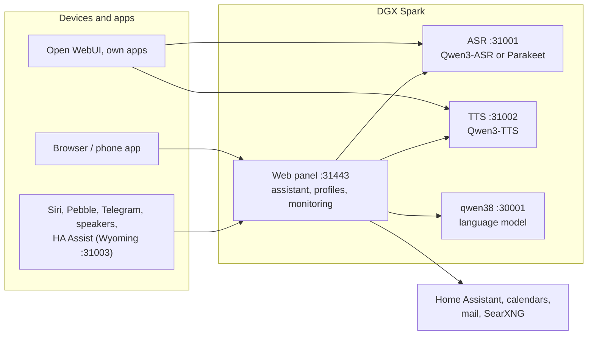

# Speech on DGX Spark

**English** | [Deutsch](README.de.md) · Idea: Dominik Bornhäußer

Speech recognition (**Qwen3-ASR**) and text to speech (**Qwen3-TTS**) as services on an NVIDIA DGX Spark (GB10), plus a web panel with a voice assistant, profiles and monitoring. Runs natively with systemd, without Docker, next to [dgx-spark-qwen38](https://github.com/hasso5703/dgx-spark-qwen38), which provides the language model.

## Installation

```bash
git clone https://github.com/db9979/speech-on-dgx-spark
cd speech-on-dgx-spark
sudo ./install.sh
```

The script asks what to install:

- **Complete**: models, APIs and the web panel with the assistant.
- **Only the models with their APIs**: for Open WebUI, your own apps or Home Assistant, without the panel. Managed with `sudo speech-spark`.

At the end it prints the address, password and API key, then TTS speaks a sentence and ASR checks it. The panel is at `https://SPARK:31443` (https is needed so the browser allows the microphone).

| Task | Command |
|---|---|
| Update | button in the panel under *Overview → System and update*, or `sudo speech-spark update` |
| Show addresses and keys | `sudo speech-spark info` |
| Uninstall | `sudo ./uninstall.sh` (config, models and voices stay; `--purge` removes everything) |

All options for running without questions (`--mode api --asr 1.7b --tts 0.6b --yes` …) are in [Installation in detail](docs/en/installation.md).

## Latest changes

<!-- New version: add one line at the top here and in CHANGELOG.md, drop the oldest line here (keep 10). Details go to docs/de and docs/en, not into this README. -->

- **V01.0.130** Web search is never silently missing: right after an answer from mail a clear search question searches again, "such im Internet" or "google mal" always goes through the search, otherwise the assistant says why it does not search
- **V01.0.129** iPhone/Safari: hands-free survives iOS ending the microphone (lock screen, call, Siri): a fresh microphone instead of a dead one, it reopens when the page is visible again and says why it stopped
- **V01.0.128** Room mode on the ESP32 speakers too (all board variants): "Raummodus an/aus" by voice or the "Room" switch under Me → Speakers, duration and room per speaker, silent in quiet hours
- **V01.0.127** Search in the settings and in the Me window (opens the page and marks the spot); browser test for every page on a computer and a phone, runs on GitHub on every push
- **V01.0.126** Room mode: text only in quiet hours, ends after 2 minutes in the background or with the phone locked, "Raummodus aus" by voice
- **V01.0.125** New menus: settings in three blocks, all checks under Overview → Checks, Integrate = guides + apps and interfaces, the Me window in the groups of the Features page with an overview and its own Notifications page
- **V01.0.124** No more clicks in longer answers: speech fades out briefly when it ends or stalls instead of stopping hard, Stop fades out, "still speaking" includes the speaker delay, the assistant's own echo at a sentence end no longer counts as an interruption
- **V01.0.123** Tidier settings: every setting right below its switch (web search, weather, speaker identification; the web search page is gone), short feature rows with marks, pages named Language model, Defaults, Operation, "Me" everywhere, warning about unsaved changes
- **V01.0.122** Cloned voices moved to Settings → Voices (with "Speak a sample"); the menu entry "Users" is now "Profiles"; Me → Voice is now "Speaker identification"
- **V01.0.121** Language model settings: history length, web searches, time limit, top_p/presence_penalty, own keywords that require a tool, prompt preview with a default button, own conversation style per profile (off); the rules stay fixed

All versions: [CHANGELOG.md](CHANGELOG.md)

## How it works



1. You speak into your phone or browser. The panel sends the audio to **speech recognition**, which turns it into text.
2. The panel passes the text, with memory, conversation history and the allowed tools, to the **language model** from qwen38.
3. When the answer needs calendars, mail, weather, web search or Home Assistant, the panel fetches the data itself; switching and adding entries only happen after you confirm.
4. The answer goes sentence by sentence to **text to speech** and is played as a stream while the model is still writing.
5. Other apps can use ASR and TTS directly through the OpenAI-style APIs, with an API key.

Every feature can be switched on per profile and is off by default. Updates only go live after a green self-test and can be rolled back.

## Read more

- [Installation in detail](docs/en/installation.md): install modes, the `speech-spark` command, all options, update, uninstall
- [Assistant and panel](docs/en/assistant.md): voice chat, phone, features, menu
- [APIs and integration](docs/en/apis-and-integration.md): transcription, speech, streaming, Open WebUI, Siri, Pebble
- [Security and operation](docs/en/security-and-operation.md): login, lockouts, backups, watchdog, self-test, logs
- [Technical details and troubleshooting](docs/en/technical.md): services and ports, benchmarks, next to qwen38, troubleshooting

The panel has its own guide for every feature under *Einbinden → Anleitungen* (Integrate → Guides).

## License

MIT, see [LICENSE](LICENSE). The models (Qwen3-ASR, Qwen3-TTS) and packages (vLLM, vllm-omni, PyTorch) are downloaded during installation and come under their own licenses. This project is not affiliated with NVIDIA or the Qwen team.
