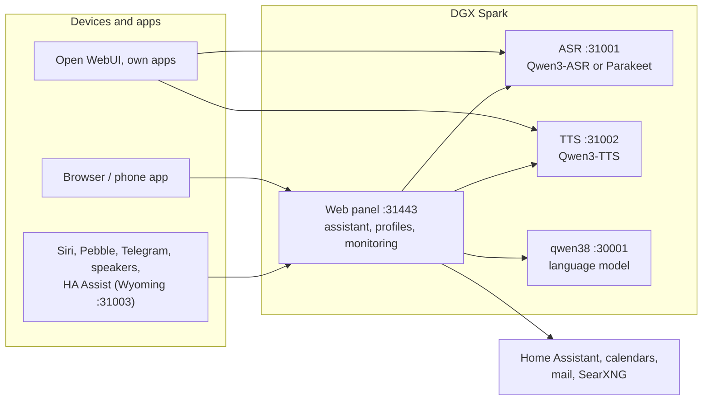

# Speech on DGX Spark

**English** | [Deutsch](README.de.md) · Idea: Dominik Bornhäußer

Speech recognition (**Qwen3-ASR**) and text to speech (**Qwen3-TTS**) as services on an NVIDIA DGX Spark (GB10), plus a web panel with a voice assistant, profiles and monitoring. Runs natively with systemd, without Docker, next to [dgx-spark-qwen38](https://github.com/hasso5703/dgx-spark-qwen38), which provides the language model.

## Installation

```bash
git clone https://github.com/db9979/speech-on-dgx-spark
cd speech-on-dgx-spark
sudo ./install.sh
```

The script asks what to install:

- **Complete**: models, APIs and the web panel with the assistant.
- **Only the models with their APIs**: for Open WebUI, your own apps or Home Assistant, without the panel. Managed with `sudo speech-spark`.

At the end it prints the address, password and API key, then TTS speaks a sentence and ASR checks it. The panel is at `https://SPARK:31443` (https is needed so the browser allows the microphone).

| Task | Command |
|---|---|
| Update | button in the panel under *Settings → Update and backup*, or `sudo speech-spark update` |
| Show addresses and keys | `sudo speech-spark info` |
| Uninstall | `sudo ./uninstall.sh` (config, models and voices stay; `--purge` removes everything) |

All options for running without questions (`--mode api --asr 1.7b --tts 0.6b --yes` …) are in [Installation in detail](docs/en/installation.md).

## Latest changes

<!-- New version: add one line at the top here and in CHANGELOG.md, drop the oldest line here (keep 10). Details go to docs/de and docs/en, not into this README. -->

- **V01.0.263** Logs → Requests (switch under Settings → Operation, off): the way of every request as a list with a bead chain and a time line (switch, model rounds, tools, check, speech output, first sound), without question or answer text; names only with the profile's consent
- **V01.0.262** Security: protection headers on every answer (no embedding in other pages, nosniff, referrer policy, microphone/camera only for the panel, HSTS on https), list of signed-in browsers with single sign-out (Me → Security, admin in the profile details), profile sign-in ends after 30 days without use (7–90 adjustable), "Security at a glance" as a traffic light at the top of Settings → Security
- **V01.0.261** Kiwix: books are saved without their date, updated files stay chosen (the newest is used, catalog re-read on 404); "Look in my archive" never searches the uploaded documents and says which switch is missing
- **V01.0.260** Kiwix: book choice as a list with search, language and kind filter (German/English first), grouped, with language, variant, article count, size and date; chosen ones on top as chips; without a choice German and English Wikipedia; catalog up to 2000 books
- **V01.0.259** Self-test "Profiles and devices" searches the test device instead of waiting on page 1 (GitHub tests green again)
- **V01.0.258** Own Kiwix archive (Features → Web search, off; profile switch): Wikipedia questions first from your own kiwix-serve, full-text search in chosen books, "Tell me more" reads on, the offline archive answers when the web search fails; Status → Checks → "Check Kiwix", Logs area "Knowledge"
- **V01.0.257** Profiles and devices: a device's profile is picked from a list instead of typed; iPhone app, speakers, Pebble watch and Home Assistant show "🔒 fixed" with where they are managed (server refuses moving them), rows aligned
- **V01.0.256** iPhone app: "Sign in with my profile" in Manage the Spark for co-admins and managers (profile code, ends after 15 min without use)
- **V01.0.255** Users as admins (switch under Settings → Security, off; only with the main admin's second step): co-admin and manager roles for profiles, admin mode under Me → Security with the profile's own code (15 min without use, 8 h at most), the main admin keeps password, roles, backups and admin profiles, Logs → Admin log shows who, app sign-in with the profile code (server)
- **V01.0.254** Settings: Speech recognition and Security no longer jump to the right on wide screens (scrollbar space always kept), second login step inside one frame, speech recognition model list no longer cut off; browser test checks it

All versions: [CHANGELOG.md](CHANGELOG.md)

## How it works



1. You speak into your phone or browser. The panel sends the audio to **speech recognition**, which turns it into text.
2. The panel passes the text, with memory, conversation history and the allowed tools, to the **language model** from qwen38.
3. When the answer needs calendars, mail, weather, web search or Home Assistant, the panel fetches the data itself; switching and adding entries only happen after you confirm.
4. The answer goes sentence by sentence to **text to speech** and is played as a stream while the model is still writing.
5. Other apps can use ASR and TTS directly through the OpenAI-style APIs, with an API key.

Every feature can be switched on per profile and is off by default. Updates only go live after a green self-test and can be rolled back.

## Read more

- [Installation in detail](docs/en/installation.md): install modes, the `speech-spark` command, all options, update, uninstall
- [Assistant and panel](docs/en/assistant.md): voice chat, phone, features, menu
- [APIs and integration](docs/en/apis-and-integration.md): transcription, speech, streaming, Open WebUI, Siri, Pebble
- [Security and operation](docs/en/security-and-operation.md): login, lockouts, backups, watchdog, self-test, logs
- [Technical details and troubleshooting](docs/en/technical.md): services and ports, benchmarks, next to qwen38, troubleshooting

The panel has its own guide for every feature under *Einbinden → Anleitungen* (Integrate → Guides).

## License

MIT, see [LICENSE](LICENSE). The models (Qwen3-ASR, Qwen3-TTS) and packages (vLLM, vllm-omni, PyTorch) are downloaded during installation and come under their own licenses. This project is not affiliated with NVIDIA or the Qwen team.
