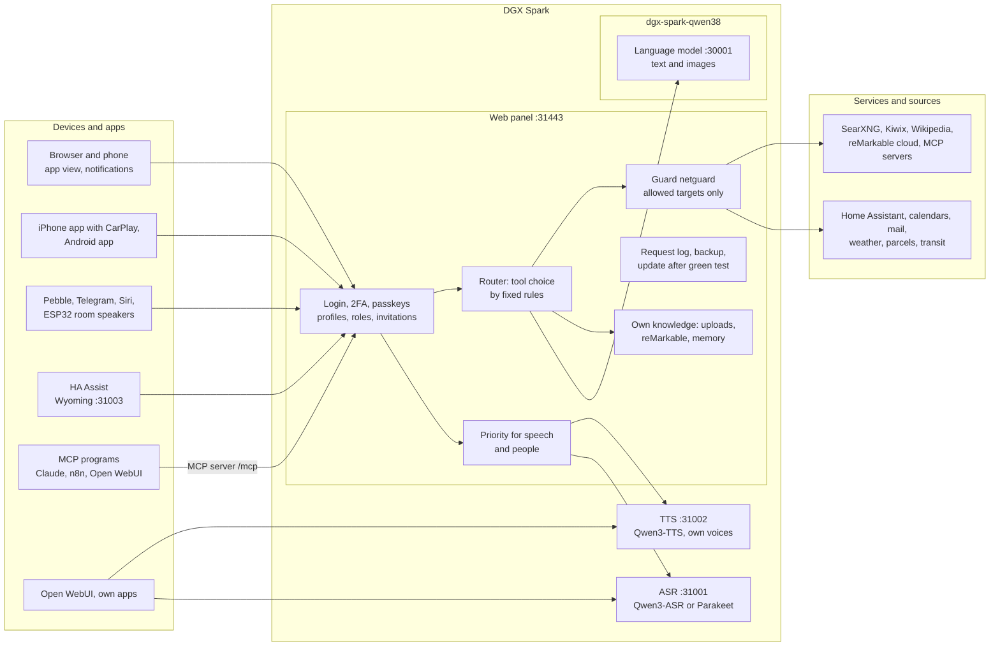

# Speech on DGX Spark

**English** | [Deutsch](README.de.md) · Idea: Dominik Bornhäußer

[](https://buymeacoffee.com/zquu1xu570)

Speech recognition (**Qwen3-ASR**) and text to speech (**Qwen3-TTS**) as services on an NVIDIA DGX Spark (GB10), plus a web panel with a voice assistant, profiles and monitoring. Runs natively with systemd, without Docker, next to [dgx-spark-qwen38](https://github.com/hasso5703/dgx-spark-qwen38), which provides the language model.

## Installation

```bash
git clone https://github.com/db9979/speech-on-dgx-spark
cd speech-on-dgx-spark
sudo ./install.sh
```

The script asks what to install:

- **Complete**: models, APIs and the web panel with the assistant.
- **Only the models with their APIs**: for Open WebUI, your own apps or Home Assistant, without the panel. Managed with `sudo speech-spark`.

At the end it prints the address, password and API key, then TTS speaks a sentence and ASR checks it. The panel is at `https://SPARK:31443` (https is needed so the browser allows the microphone).

| Task | Command |
|---|---|
| Update | button in the panel under *Settings → Update and backup*, or `sudo speech-spark update` |
| Show addresses and keys | `sudo speech-spark info` |
| Uninstall | `sudo ./uninstall.sh` (config, models and voices stay; `--purge` removes everything) |

All options for running without questions (`--mode api --asr 1.7b --tts 0.6b --yes` …) are in [Installation in detail](docs/en/installation.md).

## Latest changes

<!-- New version: add one line at the top here and in CHANGELOG.md, drop the oldest line here (keep 10). Details go to docs/de and docs/en, not into this README. -->

- **V01.0.312** Live overview (off): Status → Live shows who is asking, each request's way with times, what the guard decides, failed logins and what the services give back; plus a live monitor for a screen in the home network, paired with a one-time code
- **V01.0.311** Self-test invitation: waits for the page to reload after "Create profile" instead of a fixed 15 seconds (was red twice on GitHub)
- **V01.0.310** Diagram "How it works" shows the current state: iPhone and Android app, speakers, MCP programs, router, priority, own knowledge, guard and the outside services
- **V01.0.309** MCP "Create key" answers right under the button: a missing name or no ticked tool is said there (before at the very end of the page, it looked like nothing happened), plus "creating …" and a clear hint when the code is missing
- **V01.0.308** Logs → Requests shows at the step "Weiche" whether the model routing came in time
- **V01.0.307** Fetch ahead on a question back (off): when the assistant asks back, the panel already fetches calendar, mail, weather or parcels while the question is spoken; the model routing of unclear questions runs beside the preparation
- **V01.0.306** Self-test "phone like the app" waits by polling under the strict CSP instead of wait_for_function (was red on GitHub once)
- **V01.0.305** Self-test Features page: height limit raised for the new line "Fetch clear questions directly" (GitHub tests were red after V01.0.304, the update waited)
- **V01.0.304** Answer starts sooner: "Schneller Antwortbeginn" now keeps instructions, tool list and the start of the history the same (everything that changes goes with the question), "Eindeutiges direkt abrufen" (off) fetches mail, reminders, weather and parcels itself for short questions, Logs → Requests shows instructions, tools and conversation per round in characters
- **V01.0.303** Spark as an MCP server (Features → Spark as MCP server, profile Me → Services over MCP, all off): Open WebUI, n8n, Claude & co. use speech (transcribe, speak), look-ups (Wikipedia, archive, documents, calendar, reminders, today) and ask_spark; each program gets its own access with its own tools, "local" home network only or "external" via OAuth with a warning and the second sign-in step; acting (lights, appointments, reminders) only as a proposal with a yes in the panel; never mail, memory, history, secrets or settings

All versions: [CHANGELOG.md](CHANGELOG.md)

## How it works



1. You speak into your phone, browser, one of the apps or a speaker. The panel signs you in, sends the audio to **speech recognition** and gets text back.
2. The **router** picks by fixed rules which tools the question needs. The panel passes the text, with memory, conversation history, your own knowledge and exactly those tools, to the **language model** from qwen38.
3. When the answer needs calendars, mail, weather, Home Assistant, web search, Kiwix or Wikipedia, the panel fetches the data itself; switching and adding entries only happen after you confirm.
4. The answer goes sentence by sentence to **text to speech** and is played as a stream while the model is still writing. Priority makes sure spoken answers and important people go first.
5. Other apps use ASR and TTS directly through the OpenAI-style APIs with an API key, MCP programs use the Spark as an MCP server with their own access.

Every feature can be switched on per profile and is off by default. Updates only go live after a green self-test and can be rolled back.

## Read more

- [Installation in detail](docs/en/installation.md): install modes, the `speech-spark` command, all options, update, uninstall
- [Assistant and panel](docs/en/assistant.md): voice chat, phone, features, menu
- [APIs and integration](docs/en/apis-and-integration.md): transcription, speech, streaming, Open WebUI, Siri, Pebble
- [Security and operation](docs/en/security-and-operation.md): login, lockouts, backups, watchdog, self-test, logs
- [Technical details and troubleshooting](docs/en/technical.md): services and ports, benchmarks, next to qwen38, troubleshooting

The panel has its own guide for every feature under *Funktionen → Anleitungen* (Features → Guides).

## Support

The project is free. If you like it, you can support it at [buymeacoffee.com/zquu1xu570](https://buymeacoffee.com/zquu1xu570).

## License

MIT, see [LICENSE](LICENSE). The models (Qwen3-ASR, Qwen3-TTS) and packages (vLLM, vllm-omni, PyTorch) are downloaded during installation and come under their own licenses. This project is not affiliated with NVIDIA or the Qwen team.
