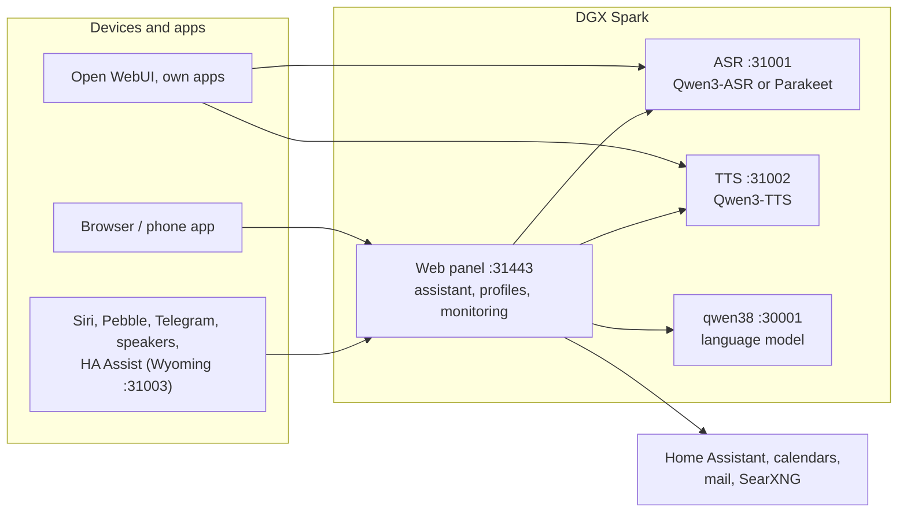

# Speech on DGX Spark

**English** | [Deutsch](README.de.md) · Idea: Dominik Bornhäußer

Speech recognition (**Qwen3-ASR**) and text to speech (**Qwen3-TTS**) as services on an NVIDIA DGX Spark (GB10), plus a web panel with a voice assistant, profiles and monitoring. Runs natively with systemd, without Docker, next to [dgx-spark-qwen38](https://github.com/hasso5703/dgx-spark-qwen38), which provides the language model.

## Installation

```bash
git clone https://github.com/db9979/speech-on-dgx-spark
cd speech-on-dgx-spark
sudo ./install.sh
```

The script asks what to install:

- **Complete**: models, APIs and the web panel with the assistant.
- **Only the models with their APIs**: for Open WebUI, your own apps or Home Assistant, without the panel. Managed with `sudo speech-spark`.

At the end it prints the address, password and API key, then TTS speaks a sentence and ASR checks it. The panel is at `https://SPARK:31443` (https is needed so the browser allows the microphone).

| Task | Command |
|---|---|
| Update | button in the panel under *Settings → Update and backup*, or `sudo speech-spark update` |
| Show addresses and keys | `sudo speech-spark info` |
| Uninstall | `sudo ./uninstall.sh` (config, models and voices stay; `--purge` removes everything) |

All options for running without questions (`--mode api --asr 1.7b --tts 0.6b --yes` …) are in [Installation in detail](docs/en/installation.md).

## Latest changes

<!-- New version: add one line at the top here and in CHANGELOG.md, drop the oldest line here (keep 10). Details go to docs/de and docs/en, not into this README. -->

- **V01.0.249** Roles by voice and Wikipedia straight away (admin and profile switch each, off): own roles under Me → Conversation, "Sei jetzt der Butler" / "Sei wieder normal" switched by the panel with fixed rules; knowledge questions from the Wikipedia intro instead of a web search, 24-hour cache
- **V01.0.248** Features: "Panel areas in the iPhone app" sits below the iPhone app switch (page stays short)
- **V01.0.247** iPhone app takes over the panel, step 3: "Manage the Spark" with admin password and code, monitoring, logs with "Copy for thread", checks
- **V01.0.246** iPhone app takes over the panel, steps 1–2: "Open in the panel", panel areas with their own switch, "My day" (appointments, reminders, memory, conversation switches)
- **V01.0.245** Document card and tags (admin and profile switch, off): in quiet minutes the language model notes title, kind, sender, deadline, number and keywords of each document; the assistant sees these lines instead of file names and searches by tag or kind, tags filter Ich → Dokumente (own ones win), "Belongs with", "Remind" before deadlines only on click; document search always stays in a narrowed tool set, more rule words (insurance, manual, findings …)
- **V01.0.244** iPhone app: My documents with "Read on" for long documents
- **V01.0.243** Ich → Dokumente → View shows long documents a part at a time with "Read on" instead of "… shortened" after 200,000 characters; the assistant's search always used the whole text
- **V01.0.242** Documents: PDFs up to 100 MB (the admin sets up to 300 MB under Funktionen → Eigene Dokumente; other files up to 20 MB, before "request too large" from 20 MB); the space per profile counts all uploads together, Ich → Dokumente shows "Used: x of y" with a bar, the admin sees and sets it per profile under Zustand → Monitoring
- **V01.0.241** The small picture before each answer in the history follows the chosen face: a comic head instead of the robot when "Comic" is picked
- **V01.0.239** Pebble sound stutters less: the watch starts after 1.5 s in its buffer (was 0.75 s) and after running dry waits until enough is back (one pause instead of scraps); the "watch: zeit" log line counts the stalls (watch app 1.5.0)

All versions: [CHANGELOG.md](CHANGELOG.md)

## How it works



1. You speak into your phone or browser. The panel sends the audio to **speech recognition**, which turns it into text.
2. The panel passes the text, with memory, conversation history and the allowed tools, to the **language model** from qwen38.
3. When the answer needs calendars, mail, weather, web search or Home Assistant, the panel fetches the data itself; switching and adding entries only happen after you confirm.
4. The answer goes sentence by sentence to **text to speech** and is played as a stream while the model is still writing.
5. Other apps can use ASR and TTS directly through the OpenAI-style APIs, with an API key.

Every feature can be switched on per profile and is off by default. Updates only go live after a green self-test and can be rolled back.

## Read more

- [Installation in detail](docs/en/installation.md): install modes, the `speech-spark` command, all options, update, uninstall
- [Assistant and panel](docs/en/assistant.md): voice chat, phone, features, menu
- [APIs and integration](docs/en/apis-and-integration.md): transcription, speech, streaming, Open WebUI, Siri, Pebble
- [Security and operation](docs/en/security-and-operation.md): login, lockouts, backups, watchdog, self-test, logs
- [Technical details and troubleshooting](docs/en/technical.md): services and ports, benchmarks, next to qwen38, troubleshooting

The panel has its own guide for every feature under *Einbinden → Anleitungen* (Integrate → Guides).

## License

MIT, see [LICENSE](LICENSE). The models (Qwen3-ASR, Qwen3-TTS) and packages (vLLM, vllm-omni, PyTorch) are downloaded during installation and come under their own licenses. This project is not affiliated with NVIDIA or the Qwen team.
