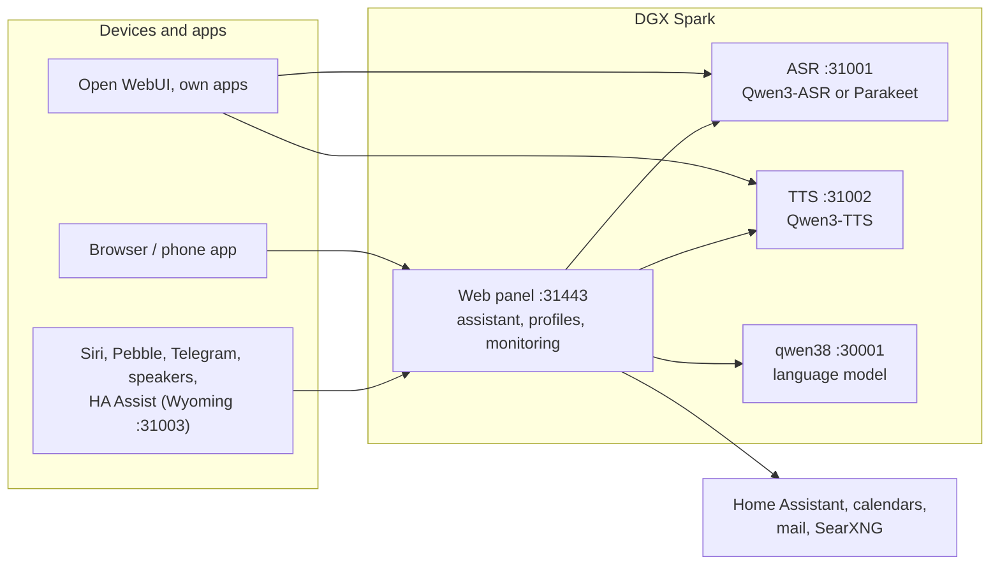

# Speech on DGX Spark

**English** | [Deutsch](README.de.md) · Idea: Dominik Bornhäußer

Speech recognition (**Qwen3-ASR**) and text to speech (**Qwen3-TTS**) as services on an NVIDIA DGX Spark (GB10), plus a web panel with a voice assistant, profiles and monitoring. Runs natively with systemd, without Docker, next to [dgx-spark-qwen38](https://github.com/hasso5703/dgx-spark-qwen38), which provides the language model.

## Installation

```bash
git clone https://github.com/db9979/speech-on-dgx-spark
cd speech-on-dgx-spark
sudo ./install.sh
```

The script asks what to install:

- **Complete**: models, APIs and the web panel with the assistant.
- **Only the models with their APIs**: for Open WebUI, your own apps or Home Assistant, without the panel. Managed with `sudo speech-spark`.

At the end it prints the address, password and API key, then TTS speaks a sentence and ASR checks it. The panel is at `https://SPARK:31443` (https is needed so the browser allows the microphone).

| Task | Command |
|---|---|
| Update | button in the panel under *Settings → Update and backup*, or `sudo speech-spark update` |
| Show addresses and keys | `sudo speech-spark info` |
| Uninstall | `sudo ./uninstall.sh` (config, models and voices stay; `--purge` removes everything) |

All options for running without questions (`--mode api --asr 1.7b --tts 0.6b --yes` …) are in [Installation in detail](docs/en/installation.md).

## Latest changes

<!-- New version: add one line at the top here and in CHANGELOG.md, drop the oldest line here (keep 10). Details go to docs/de and docs/en, not into this README. -->

- **V01.0.277** iPhone app: first answer with sound (waits out the route switch after start, replays dropped pieces), "Copy sound log" in settings
- **V01.0.276** New people by invitation (Personen und Geräte → Neue Personen, off): link, QR code or printed card, valid once, starter packs "Familie"/"Gast plus", second sign-in step required for e-mail, documents and jobs; then Me → "Los geht's" walks through devices and services (the Spark ticks off itself), "Continue on the phone" by QR code with number matching, PIN link and Remind in the profile details, the iPhone app takes invitations
- **V01.0.275** Main admin as a profile (one login, the password stays the emergency access), one shell for signed-in profiles, words tidied (admin rights, tool history, update history, Spark verwalten)
- **V01.0.274** reMarkable: the "All notebooks" tick and single ticks stay while the list loads (counter "x / y"), the search field keeps focus; the connect link goes straight to my.remarkable.com/pair
- **V01.0.273** reMarkable notes (Features → Read pictures and scans, off; Me → reMarkable): connect the my.remarkable account with a one-time code, chosen notebooks go into the document search (typed text and highlights directly, the language model reads handwriting in quiet moments, only changed pages again); "Send to the reMarkable" (off) puts answers and dictated notes as EPUB into the folder "Spark"
- **V01.0.272** iPhone app reads function names, groups and locks from the Spark instead of its own lists; profile in the app with functions "n of m on", role and browsers; hands-free and barge-in belong to the profile
- **V01.0.271** People and devices: one profile in one place with access, functions "n of m on", rights (jobs, app update, upload space), signing browsers out, a guests row and "+ New"
- **V01.0.270** Unify phase 4: one row building block (setRow) for all settings, what the admin switched off stays visible under Ich with the reason, Ich names functions not switched on, column "Neue Profile" under Wer darf was, presets never turn on a function switch
- **V01.0.269** Unify phase 3: Funktionen → "Wer darf was" (Spark, each profile, guests; filters new/needs you; phone with profile chips), the admin switches profile switches with an admin log entry, also for managers
- **V01.0.268** Unify phase 2: defaults only from config.default.json (load_config fills missing keys), presets and own values only through profiles.effective; self-test against second defaults and hand merges

All versions: [CHANGELOG.md](CHANGELOG.md)

## How it works



1. You speak into your phone or browser. The panel sends the audio to **speech recognition**, which turns it into text.
2. The panel passes the text, with memory, conversation history and the allowed tools, to the **language model** from qwen38.
3. When the answer needs calendars, mail, weather, web search or Home Assistant, the panel fetches the data itself; switching and adding entries only happen after you confirm.
4. The answer goes sentence by sentence to **text to speech** and is played as a stream while the model is still writing.
5. Other apps can use ASR and TTS directly through the OpenAI-style APIs, with an API key.

Every feature can be switched on per profile and is off by default. Updates only go live after a green self-test and can be rolled back.

## Read more

- [Installation in detail](docs/en/installation.md): install modes, the `speech-spark` command, all options, update, uninstall
- [Assistant and panel](docs/en/assistant.md): voice chat, phone, features, menu
- [APIs and integration](docs/en/apis-and-integration.md): transcription, speech, streaming, Open WebUI, Siri, Pebble
- [Security and operation](docs/en/security-and-operation.md): login, lockouts, backups, watchdog, self-test, logs
- [Technical details and troubleshooting](docs/en/technical.md): services and ports, benchmarks, next to qwen38, troubleshooting

The panel has its own guide for every feature under *Einbinden → Anleitungen* (Integrate → Guides).

## License

MIT, see [LICENSE](LICENSE). The models (Qwen3-ASR, Qwen3-TTS) and packages (vLLM, vllm-omni, PyTorch) are downloaded during installation and come under their own licenses. This project is not affiliated with NVIDIA or the Qwen team.
