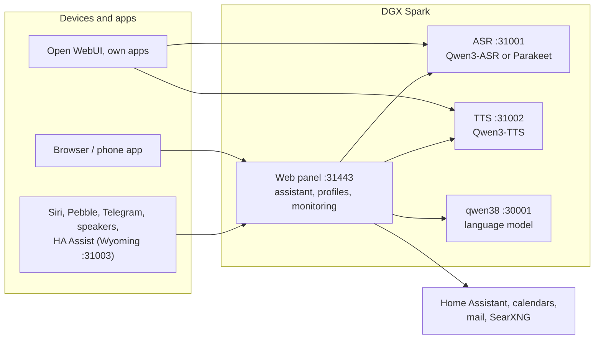

# Speech on DGX Spark

**English** | [Deutsch](README.de.md) · Idea: Dominik Bornhäußer

Speech recognition (**Qwen3-ASR**) and text to speech (**Qwen3-TTS**) as services on an NVIDIA DGX Spark (GB10), plus a web panel with a voice assistant, profiles and monitoring. Runs natively with systemd, without Docker, next to [dgx-spark-qwen38](https://github.com/hasso5703/dgx-spark-qwen38), which provides the language model.

## Installation

```bash
git clone https://github.com/db9979/speech-on-dgx-spark
cd speech-on-dgx-spark
sudo ./install.sh
```

The script asks what to install:

- **Complete**: models, APIs and the web panel with the assistant.
- **Only the models with their APIs**: for Open WebUI, your own apps or Home Assistant, without the panel. Managed with `sudo speech-spark`.

At the end it prints the address, password and API key, then TTS speaks a sentence and ASR checks it. The panel is at `https://SPARK:31443` (https is needed so the browser allows the microphone).

| Task | Command |
|---|---|
| Update | button in the panel under *Status → System and update*, or `sudo speech-spark update` |
| Show addresses and keys | `sudo speech-spark info` |
| Uninstall | `sudo ./uninstall.sh` (config, models and voices stay; `--purge` removes everything) |

All options for running without questions (`--mode api --asr 1.7b --tts 0.6b --yes` …) are in [Installation in detail](docs/en/installation.md).

## Latest changes

<!-- New version: add one line at the top here and in CHANGELOG.md, drop the oldest line here (keep 10). Details go to docs/de and docs/en, not into this README. -->

- **V01.0.151** The update waits up to 10 minutes when apt is busy (e.g. automatic upgrades) instead of failing
- **V01.0.150** Quality test: calendar cases name "tomorrow" and "Tuesday" relative to today (the fixed 8 Oct was wrong from 8 Oct on)
- **V01.0.149** Speaker page tidied: list → one page per speaker (sound, room mode with "Start" and selectable kinds, voice, firmware, check), "Add a speaker" over USB or by code, admin "Check address", speaker keys marked
- **V01.0.148** Browser test for Zustand also holds where systemd reports real services (GitHub)
- **V01.0.147** Design "Klar", step 3: on a computer Ich opens as a page beside the sidebar instead of a window; another menu entry closes it
- **V01.0.146** Design "Klar", step 2: Zustand (status) starts with one sentence ("Everything is running." or what is not) and "Braucht dich" (needs you: update, unsaved settings, service off/failing) with a button to each place; green/yellow/red dot in the menu; qwen38 and GPU processes folded
- **V01.0.145** Design "Klar", step 1: menu as a sidebar on computers (Assistent, Ich, then "Spark verwalten" with Zustand, Einstellungen, Profile und Geräte, Einbinden) and a bottom bar on phones; "Übersicht" is now "Zustand" (status), count of unsaved settings pages in the menu
- **V01.0.144** Follow-up without wake word (off, admin + profile): after answering a spoken question the assistant keeps listening for 4–10 seconds, "And tomorrow?" needs no "Hey Spark"
- **V01.0.143** Hands-free listens again even when the browser has paused playback (iOS, no speaker): "still speaking" only counts when something is actually playing; GitHub test green again
- **V01.0.142** Speakers: "Stimme hier anlernen" (three sentences, own voiceprint for the board microphone); "only known voices" applies at a speaker only once a voice was taught there

All versions: [CHANGELOG.md](CHANGELOG.md)

## How it works



1. You speak into your phone or browser. The panel sends the audio to **speech recognition**, which turns it into text.
2. The panel passes the text, with memory, conversation history and the allowed tools, to the **language model** from qwen38.
3. When the answer needs calendars, mail, weather, web search or Home Assistant, the panel fetches the data itself; switching and adding entries only happen after you confirm.
4. The answer goes sentence by sentence to **text to speech** and is played as a stream while the model is still writing.
5. Other apps can use ASR and TTS directly through the OpenAI-style APIs, with an API key.

Every feature can be switched on per profile and is off by default. Updates only go live after a green self-test and can be rolled back.

## Read more

- [Installation in detail](docs/en/installation.md): install modes, the `speech-spark` command, all options, update, uninstall
- [Assistant and panel](docs/en/assistant.md): voice chat, phone, features, menu
- [APIs and integration](docs/en/apis-and-integration.md): transcription, speech, streaming, Open WebUI, Siri, Pebble
- [Security and operation](docs/en/security-and-operation.md): login, lockouts, backups, watchdog, self-test, logs
- [Technical details and troubleshooting](docs/en/technical.md): services and ports, benchmarks, next to qwen38, troubleshooting

The panel has its own guide for every feature under *Einbinden → Anleitungen* (Integrate → Guides).

## License

MIT, see [LICENSE](LICENSE). The models (Qwen3-ASR, Qwen3-TTS) and packages (vLLM, vllm-omni, PyTorch) are downloaded during installation and come under their own licenses. This project is not affiliated with NVIDIA or the Qwen team.
