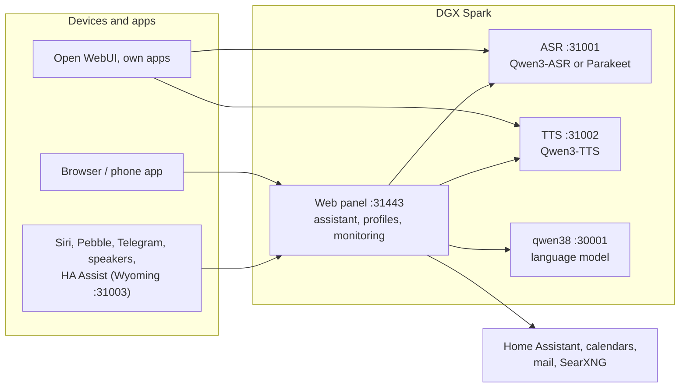

# Speech on DGX Spark

**English** | [Deutsch](README.de.md) · Idea: Dominik Bornhäußer

Speech recognition (**Qwen3-ASR**) and text to speech (**Qwen3-TTS**) as services on an NVIDIA DGX Spark (GB10), plus a web panel with a voice assistant, profiles and monitoring. Runs natively with systemd, without Docker, next to [dgx-spark-qwen38](https://github.com/hasso5703/dgx-spark-qwen38), which provides the language model.

## Installation

```bash
git clone https://github.com/db9979/speech-on-dgx-spark
cd speech-on-dgx-spark
sudo ./install.sh
```

The script asks what to install:

- **Complete**: models, APIs and the web panel with the assistant.
- **Only the models with their APIs**: for Open WebUI, your own apps or Home Assistant, without the panel. Managed with `sudo speech-spark`.

At the end it prints the address, password and API key, then TTS speaks a sentence and ASR checks it. The panel is at `https://SPARK:31443` (https is needed so the browser allows the microphone).

| Task | Command |
|---|---|
| Update | button in the panel under *Settings → Update and backup*, or `sudo speech-spark update` |
| Show addresses and keys | `sudo speech-spark info` |
| Uninstall | `sudo ./uninstall.sh` (config, models and voices stay; `--purge` removes everything) |

All options for running without questions (`--mode api --asr 1.7b --tts 0.6b --yes` …) are in [Installation in detail](docs/en/installation.md).

## Latest changes

<!-- New version: add one line at the top here and in CHANGELOG.md, drop the oldest line here (keep 10). Details go to docs/de and docs/en, not into this README. -->

- **V01.0.240** Read long documents at night (admin switch below Read pictures and scans, off): by day only documents up to 10 pages in quiet moments, long ones only after 30 minutes without a question or in the night window (default 01:00–06:00), up to 400 extra pages at night; Ich → Dokumente shows "long document, read at night from 01:00"
- **V01.0.239** Pebble sound stutters less: the watch starts after 1.5 s in its buffer (was 0.75 s) and after running dry waits until enough is back (one pause instead of scraps); the "watch: zeit" log line counts the stalls (watch app 1.5.0)
- **V01.0.238** Complete scans: scanned PDF pages are rendered as whole pages (pypdfium2 4.30.0) instead of taking the biggest picture, so no pages get lost; up to 300 scanned pages per document (100 a day, then the next day); limits and skipped pages are named on the document; "Read again" from the kept original (keeps place, "For everyone" and search); a shortened chat attachment from the app says it is only the beginning
- **V01.0.237** Update check: GitHub limit of 60 questions per hour recognised (notice with time instead of an error flood), status code in the log
- **V01.0.236** Shared documents: a profile shares single finished documents with "For everyone" (no new reading), the other profiles find them in their search and see them under Ich → Dokumente → "Shared for everyone by others"; only the owner or the admin (Zustand → Monitoring) takes it back; never guests or unknown voices at a speaker; admin and profile switch, both off
- **V01.0.235** Speaker voice check you can follow: Logs → speakers shows per question the match, the value needed and the seconds of speech; a too short question gets asked again as a whole sentence; "teach voice here" takes five sentences
- **V01.0.234** Pebble easier to install: Me → Pebble watch shows a QR code for the app file and the three steps (app onto the watch, watch connected?, pair); when the Spark has a newer watch app, "Neue Uhr-App" shows under an answer at most once a day (watch app 1.4.0)
- **V01.0.233** iPhone app: first answer after start has sound again (playback restarts after echo cancellation switches on)
- **V01.0.232** Ich → Dokumente shows each document's progress: "page 3 of 12 read" with a bar and the reason (reading page …, waits for a quiet minute, daily limit, switch off), then "meaning 40 of 120"; the list refreshes every 10 s while something runs; the iPhone app shows "page x of y read"
- **V01.0.231** "Check priority" measures the case with priority like a real conversation (recognition first, then speech output)

All versions: [CHANGELOG.md](CHANGELOG.md)

## How it works



1. You speak into your phone or browser. The panel sends the audio to **speech recognition**, which turns it into text.
2. The panel passes the text, with memory, conversation history and the allowed tools, to the **language model** from qwen38.
3. When the answer needs calendars, mail, weather, web search or Home Assistant, the panel fetches the data itself; switching and adding entries only happen after you confirm.
4. The answer goes sentence by sentence to **text to speech** and is played as a stream while the model is still writing.
5. Other apps can use ASR and TTS directly through the OpenAI-style APIs, with an API key.

Every feature can be switched on per profile and is off by default. Updates only go live after a green self-test and can be rolled back.

## Read more

- [Installation in detail](docs/en/installation.md): install modes, the `speech-spark` command, all options, update, uninstall
- [Assistant and panel](docs/en/assistant.md): voice chat, phone, features, menu
- [APIs and integration](docs/en/apis-and-integration.md): transcription, speech, streaming, Open WebUI, Siri, Pebble
- [Security and operation](docs/en/security-and-operation.md): login, lockouts, backups, watchdog, self-test, logs
- [Technical details and troubleshooting](docs/en/technical.md): services and ports, benchmarks, next to qwen38, troubleshooting

The panel has its own guide for every feature under *Einbinden → Anleitungen* (Integrate → Guides).

## License

MIT, see [LICENSE](LICENSE). The models (Qwen3-ASR, Qwen3-TTS) and packages (vLLM, vllm-omni, PyTorch) are downloaded during installation and come under their own licenses. This project is not affiliated with NVIDIA or the Qwen team.
